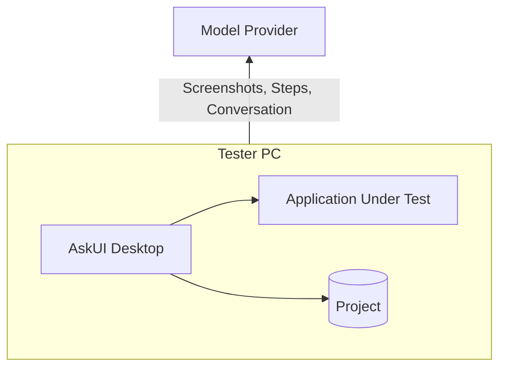
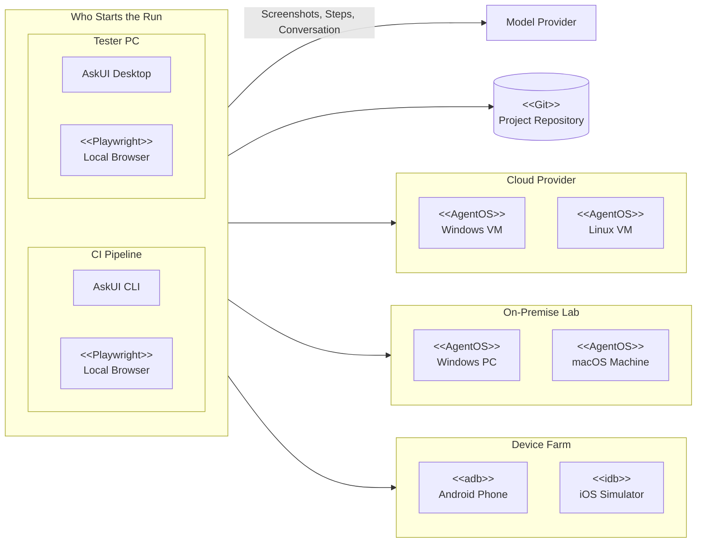

Everything here answers one question: what does bringing AskUI into your
environment actually mean? The short version, screenshots of your
applications go to an AI model for the agent's decisions; everything else
(testware, reports, secrets) stays on your machines. The full picture, in the
order a security or infrastructure review asks for it:

## Start simple: one computer

The smallest setup is one machine: [AskUI Desktop](/docs/get-started/install-desktop)
and the application under test side by side on the tester's PC, with the
[project](/docs/projects) — tests, prompts and reports — in a folder next to
them. The only thing that leaves the machine is the model traffic:

The **model provider** is the AI service that makes the agent's decisions:
the AskUI hub by default, or one you bring yourself — the choice, and what
it means for your data, is in
[What leaves the network](#what-leaves-the-network-and-how-to-stop-it).

Nothing to provision, no server, no CI: install, sign in, write a test, run
it ([first run](/docs/get-started/first-run)). Most teams stay here for
their first weeks.

## Expand to scale

When tests should run without a tester present, the same
[project](/docs/projects) moves outward in three steps, each one optional and
independent. The [AskUI CLI](/docs/running-tests/cli) runs it headless, the
same way Desktop does interactively:

Every box is one real thing you provision, and every group is optional: VMs
at your cloud provider, machines in your own lab, a rack of phones and
[simulators](/docs/devices/ios-simulator). Browsers are the exception, they
need no machine of their own: Playwright runs on whichever machine started
the run. Desktop and the CI pipeline drive the same targets from the same
project, so a test written on a tester's PC runs unchanged in the pipeline.

- **Remote test machines**: the application under test moves off the
  tester's PC onto dedicated machines running
  [AgentOS](/docs/devices/remote-computer), so a run can't disturb anyone's
  desktop and several tests can run at once.
- **The project in Git**: the same folder for everyone, reviewed like code
  ([versioning](/docs/projects#git-versioning--sync)).
- **CI pipeline**: the [CLI](/docs/running-tests/cli) runs the same project
  headless on every merge or on a
  [schedule](/docs/running-tests/scheduling), against the same machines
  ([AskUI in CI](/docs/guides/askui-in-ci)).

Who owns which part of that setup:
[Team setups](/docs/concepts/team-setups).

## The four components

A raw CUA can drive a screen. Turning that into test automation an
enterprise runs every day, on its own machines, inside its own network,
under its own governance, takes four things, and each one runs somewhere
you control:

| Component | Role |
| --- | --- |
| **AskUI Desktop** | Where you author, run, and review, [projects](/docs/projects), [devices](/docs/devices), [reports](/docs/results/run-report) |
| **AskUI CLI** | The same runs, headless, [CI and scheduled execution](/docs/running-tests/cli) |
| **AgentOS** | Gives the agent eyes and hands on a machine: screen, keyboard, mouse, [details](/docs/agentos) |
| **AskUI Hub** | Workspace, members, tokens, billing, [account](/docs/account-billing/workspaces) |

Where each one runs, what it talks to, and what it stores follows below;
the enterprise questions, proxy, air-gapped operation, CI runners, are in
[Infrastructure requirements](#infrastructure-requirements).

## What talks to what

| Connection | Protocol | Notes |
| --- | --- | --- |
| Desktop/CLI → AgentOS | gRPC, port 23000 (app-spawned) or 26000 (installed service) | Screen, keyboard, mouse of a [desktop machine](/docs/devices/remote-computer) |
| Desktop/CLI → browser | Playwright, local | [Web profiles](/docs/devices/web-browser), no AgentOS involved |
| Desktop/CLI → Android | adb, local/USB/wireless | [Emulators](/docs/devices/android-emulator) and [phones](/docs/devices/android-phone) |
| Desktop/CLI → model provider | HTTPS | See below, the only place test content leaves your network |
| Desktop → AskUI Hub | HTTPS | Sign-in, tokens, usage. Not involved in test execution itself |

Endpoints and firewall rules:
[Network requirements](/docs/reference/network-requirements).

## What leaves the network (and how to stop it)

Each [loop iteration](/docs/concepts/computer-use-agent#the-loop) sends the
current **screenshot, the step's text and the conversation so far** (earlier
screenshots, decisions and tool results of this phase) to the model provider.
That is the inference the agent's decisions are made of, and the only test
content that travels at all. Where it travels is your choice:

- **AskUI hub** (default), inference runs through us, billed with your
  workspace.
- **Your own cloud tenancy**: with
  [BYOM](/docs/extending/model-providers) the traffic goes to an endpoint you
  own instead, so it stays inside contracts and a cloud account you already
  hold. This is what most IT-security reviews approve. Your Anthropic
  account, [Azure AI Foundry](https://learn.microsoft.com/azure/ai-foundry/)
  and gateways behind
  [Microsoft Entra](/docs/extending/model-providers) work out of the box.
  **AWS Bedrock**, **GCP Vertex AI** and internal gateways with their own
  authentication scheme need that scheme implemented, so if your models sit
  behind one, [talk to us](/docs/support/get-help) — we support you in
  getting it wired up.
- **On-premise inference**: point BYOM at a vision model you host yourself
  (vLLM, SGLang) and nothing leaves your network at all. If you don't have
  the hardware for it, we can supply a local deployment on NVIDIA hardware
  you purchase, [talk to us](/docs/support/get-help).

## What is stored where

| Data | Location |
| --- | --- |
| Testware, tests, procedures, plans, rules | The [project folder](/docs/projects), plain files, yours to version |
| Agent files, the `prompts/` folder, tool and device configuration | Same folder, versioned alongside the testware |
| Test evidence, reports, screenshots, logs | `agent_workspace/` inside the project, local |
| Credentials for tests | The app's [secret store](/docs/extending/secrets), encrypted with your Windows/macOS user account, never in the project |
| Sign-in tokens | Encrypted local storage on your machine |

## What is downloaded at runtime

For supply-chain review, the app fetches on demand, each after an explicit
action on your side: browser bundles (first
[web-profile](/docs/devices/web-browser) connect), the Android SDK toolchain
(consent click on [Set up](/docs/devices/android-emulator)), NuGet packages
declared by your [custom tools](/docs/extending/custom-tools) (resolved via
your own `NuGet.config`, so enterprise feeds and mirrors apply), and
connections to the [MCP servers](/docs/extending/mcp) your project registers.

## Infrastructure requirements

| Question | Answer |
| --- | --- |
| **Operating systems** | AskUI Desktop: Windows and macOS. AgentOS on target machines: Windows 10+/Server 2019+, macOS 10.15+, Ubuntu 18.04+, [full matrix](/docs/agentos/reference/system-requirements) |
| **Proxy** | A system/corporate proxy is supported app-wide (Settings → Network proxy), including NTLM/Kerberos authentication, covers sign-in, model provider, and MCP traffic. [Troubleshooting proxy & SSL](/docs/troubleshooting/proxy-ssl) |
| **Air-gapped / no AskUI account** | [License-key mode](/docs/get-started/licensing) removes the hub from the picture entirely: activate locally, bring your own model endpoint. Runtime downloads (browsers, Android SDK) still need a reachable mirror or pre-provisioned tooling |
| **CI runners** | The [CLI](/docs/running-tests/cli) authenticates via `ASKUI_WORKSPACE_ID` / `ASKUI_TOKEN`. Headless browser targets run on a bare runner; desktop targets need a machine with [AgentOS](/docs/agentos/deployment/ci) and a real session |
| **Team rollout** | Which teams run what, and on whose machines: [AskUI in your organization](/docs/concepts/team-setups) |
