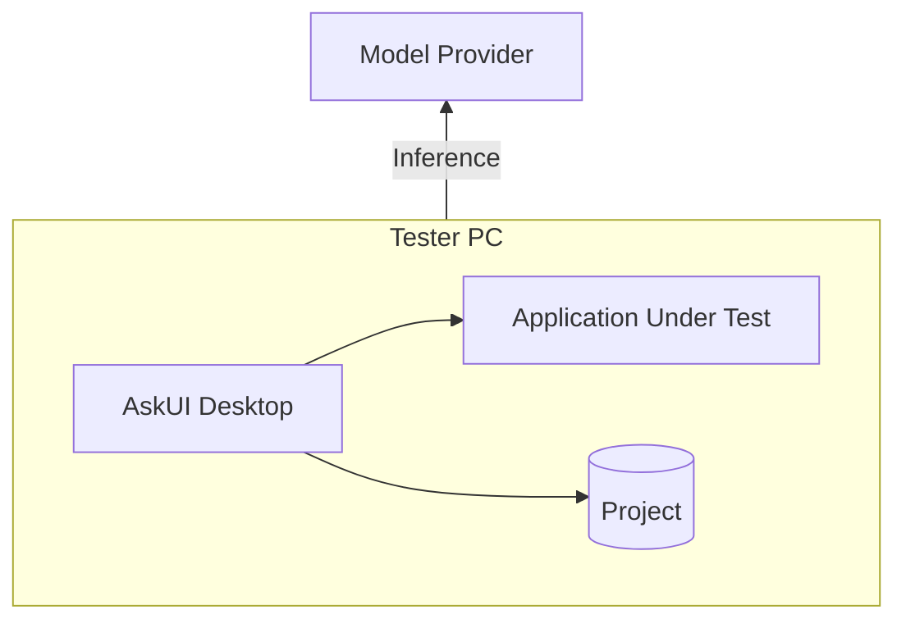
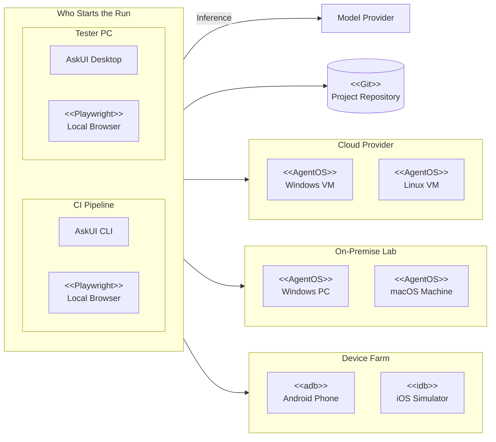

Everything here answers one question: what does bringing AskUI into your
environment actually mean? The short version, screenshots of your
applications go to an AI model for the agent's decisions; everything else
(testware, reports, secrets) stays on your machines.

Straight to your questions:

| If you are | Start at |
| --- | --- |
| **A software architect** | [The four components](#the-four-components), [What talks to what](#what-talks-to-what), [Concurrency and upgrades](#concurrency-and-upgrades) |
| **IT security** | [What leaves the network](#what-leaves-the-network-and-how-to-stop-it), [What the agent may do on a machine](#what-the-agent-may-do-on-a-machine), [Telemetry](#telemetry-what-we-see), [Inbound ports](#what-talks-to-what), [hardening a run](/docs/best-practices/security) |
| **Compliance** | [Data protection](#data-protection), [What is stored where](#what-is-stored-where), [What is downloaded at runtime](#what-is-downloaded-at-runtime) |
| **The team running the lab** | [Running the lab machines](#running-the-lab-machines), [Infrastructure requirements](#infrastructure-requirements) |

The full picture, in the order a review usually asks for it:

## Start simple: one computer

The smallest setup is one machine: [AskUI Desktop](/docs/get-started/install-desktop)
and the application under test side by side on the tester's PC, with the
[project](/docs/projects), tests, prompts and reports, in a folder next to
them. The only thing that leaves the machine is the inference traffic: the
screenshot, the step text and the conversation of the current test:

The **model provider** is the AI service that makes the agent's decisions:
the AskUI hub by default, or one you bring yourself, the choice, and what
it means for your data, is in
[What leaves the network](#what-leaves-the-network-and-how-to-stop-it).

Nothing to provision, no server, no CI: install, sign in, write a test, run
it ([first run](/docs/get-started/first-run)). Most teams stay here for
their first weeks.

## Expand to scale

When tests should run without a tester present, the same
[project](/docs/projects) moves outward in three steps, each one optional and
independent. The [AskUI CLI](/docs/running-tests/cli) runs it headless, the
same way Desktop does interactively:

Every box is one real thing you provision, and every group is optional: VMs
at your cloud provider, machines in your own lab, a rack of phones and
[simulators](/docs/devices/ios-simulator). Browsers are the exception, they
need no machine of their own: Playwright runs on whichever machine started
the run. Desktop and the CI pipeline drive the same targets from the same
project, so a test written on a tester's PC runs unchanged in the pipeline.

- **Remote test machines**: the application under test moves off the
  tester's PC onto dedicated machines running
  [AgentOS](/docs/devices/remote-computer), so a run can't disturb anyone's
  desktop and several tests can run at once.
- **The project in Git**: the same folder for everyone, reviewed like code
  ([versioning](/docs/projects#git-versioning--sync)).
- **CI pipeline**: the [CLI](/docs/running-tests/cli) runs the same project
  headless on every merge or on a
  [schedule](/docs/running-tests/scheduling), against the same machines
  ([AskUI in CI](/docs/guides/askui-in-ci)).

Who owns which part of that setup:
[Sharing the project](/docs/concepts/team-setups).

## The four components

A raw CUA can drive a screen. Turning that into test automation an
enterprise runs every day, on its own machines, inside its own network,
under its own governance, takes four things, and each one runs somewhere
you control:

| Component | Role |
| --- | --- |
| **AskUI Desktop** | Where you author, run, and review, [projects](/docs/projects), [devices](/docs/devices), [reports](/docs/results/run-report) |
| **AskUI CLI** | The same runs, headless, [CI and scheduled execution](/docs/running-tests/cli) |
| **AgentOS** | Gives the agent eyes and hands on a machine: screen, keyboard, mouse, [details](/docs/agentos) |
| **AskUI Hub** | Workspace, members, tokens, billing, [account](/docs/account-billing/workspaces) |

Where each one runs, what it talks to, and what it stores follows below;
the enterprise questions, proxy, air-gapped operation, CI runners, are in
[Infrastructure requirements](#infrastructure-requirements).

## What talks to what

| Connection | Protocol | Notes |
| --- | --- | --- |
| Desktop/CLI → AgentOS | gRPC, port 23000 (app-spawned) or 26000 (installed service) | Screen, keyboard, mouse of a [desktop machine](/docs/devices/remote-computer) |
| Desktop/CLI → browser | Playwright, local | [Web profiles](/docs/devices/web-browser), no AgentOS involved |
| Desktop/CLI → Android | adb, local/USB/wireless | [Emulators](/docs/devices/android-emulator) and [phones](/docs/devices/android-phone) |
| Desktop/CLI → model provider | HTTPS | See below, the only place test content leaves your network |
| Desktop → AskUI Hub | HTTPS | Sign-in, tokens, usage. Not involved in test execution itself |

Read the first row as an **inbound port on the target machine**: AgentOS
listens there, and Desktop or the CLI connects in. Nothing else in the
picture listens; every other arrow is outbound from the machine that starts
the run. Restrict the AgentOS port to the machines that are allowed to drive
tests.

Endpoints and firewall rules:
[Network requirements](/docs/reference/network-requirements).

## What leaves the network (and how to stop it)

Each [loop iteration](/docs/concepts/computer-use-agent#the-loop) sends the
current **screenshot, the step's text and the conversation so far** (earlier
screenshots, decisions and tool results of this phase) to the model provider.
That is the inference the agent's decisions are made of, and the only test
content that travels at all. Where it travels is your choice:

- **AskUI hub** (default), inference runs through us, billed with your
  workspace.
- **Your own cloud tenancy**: with
  [BYOM](/docs/extending/model-providers) the traffic goes to an endpoint you
  own instead, so it stays inside contracts and a cloud account you already
  hold. This is what most IT-security reviews approve. Your Anthropic
  account, [Azure AI Foundry](https://learn.microsoft.com/azure/ai-foundry/)
  and gateways behind
  [Microsoft Entra](/docs/extending/model-providers) work out of the box.
  **AWS Bedrock**, **GCP Vertex AI** and internal gateways with their own
  authentication scheme need that scheme implemented, so if your models sit
  behind one, [talk to us](/docs/support/get-help), we support you in
  getting it wired up.
- **On-premise inference**: point BYOM at a vision model you host yourself
  (vLLM, SGLang) and nothing leaves your network at all. If you don't have
  the hardware for it, we can supply a local deployment on NVIDIA hardware
  you purchase, [talk to us](/docs/support/get-help).

## What the agent may do on a machine

The blast radius is the toolbox, not the machine. The agent can only act
through tools it was given, and you decide which:

- **Screen, keyboard, mouse** come with the device and are always there.
  Within a session the agent can do what the logged-in user can do.
- **Reach beyond the UI is opt-in**: the shell, SQL and file tools in the
  [Tool Store](/docs/extending/tools) are off until someone enables them,
  and enabling them is recorded in `utils/tools.json` in the project, so it
  shows up in review.
- **Custom tools are code**: a `.cs` file in
  [`utils/custom_tools/`](/docs/extending/custom-tools) runs with the
  permissions of the run, which is why they belong to developers and get
  reviewed like any other code in the repository.
- **Elevation is a deliberate switch**: without
  ["Allow control of administrative applications"](/docs/agentos/installation/service)
  the agent cannot drive elevated windows.
- **Credentials never reach the model**: steps reference
  [secrets](/docs/extending/secrets) by name, values are substituted at
  execution time and redacted from reports and logs.

How to keep that reach as small as a test needs, account rights, scoping each
tool, what belongs in review:
[What the agent may do](/docs/best-practices/security).

## Telemetry, what we see

- **The hub** sees sign-in, tokens and usage counters for billing, not your
  test content ([usage dashboard](/docs/account-billing/usage-dashboard)).
- **Model traffic** goes to the provider you chose, and only that provider,
  see above.
- **OpenTelemetry tracing is off by default.** It exists for teams that want
  traces in their own collector and is enabled explicitly with
  `ASKUI__OTEL_*` environment variables, pointing at an endpoint you own.
- **Reports and screenshots stay local**, in the project folder. Nothing
  uploads them anywhere.

## Data protection

- **Test content that travels** is limited to what the model provider needs
  for inference: the screenshot, the step text and the conversation of the
  current phase. Nothing else is transmitted, and with
  [on-premise inference](#what-leaves-the-network-and-how-to-stop-it) not
  even that.
- **Screenshots can contain personal data** if your test data does. That is
  a processing decision on your side: choose the provider placement
  accordingly, and prefer synthetic or anonymised test data.
- **Evidence lives with you**: reports, screenshots and the conversation log
  are files in your project, so your retention and deletion rules apply
  unchanged.
- **DPA, retention at the hub, hosting region, and whether a provider trains
  on inputs** depend on the provider you choose and your contract with us:
  [ask us for the current documents](/docs/support/get-help) rather than
  assuming.

## What is stored where

| Data | Location |
| --- | --- |
| Testware, tests, procedures, plans, rules | The [project folder](/docs/projects), plain files, yours to version |
| Agent files, `tests/ui.md`, `tests/rules.md`, `utils/format.md`, tool and device configuration | Same folder, versioned alongside the testware |
| Test evidence, reports, screenshots, logs | `agent_workspace/` inside the project, local |
| Credentials for tests | The app's [secret store](/docs/extending/secrets), encrypted with your Windows/macOS user account, never in the project |
| Sign-in tokens | Encrypted local storage on your machine |

## What is downloaded at runtime

For supply-chain review, the app fetches on demand, each after an explicit
action on your side: browser bundles (first
[web-profile](/docs/devices/web-browser) connect), the Android SDK toolchain
(consent click on [Set up](/docs/devices/android-emulator)), NuGet packages
declared by your [custom tools](/docs/extending/custom-tools) (resolved via
your own `NuGet.config`, so enterprise feeds and mirrors apply), and
connections to the [MCP servers](/docs/extending/mcp) your project registers.

## Running the lab machines

What the team providing the machines needs to know:

- **Interactive session required.** The agent works on a real desktop
  session: a locked screen or a machine with no session has nothing to
  drive, and a run against it ends as `BROKEN`. Keep sessions unlocked and
  screensavers/sleep disabled on test machines.
- **Service or standalone.** AgentOS can run as an installed
  [Windows service](/docs/agentos/installation/service) (port 26000, starts
  with the machine, survives reboots, the choice for shared lab machines) or
  be started by the app on demand (port 23000, fine on a tester's own PC).
- **Elevation.** Driving elevated windows requires enabling
  ["Allow control of administrative applications"](/docs/agentos/installation/service)
  during installation.
- **Sizing.** Requirements per machine, including what a VM needs:
  [system requirements](/docs/agentos/reference/system-requirements). No GPU
  is needed on the test machine, inference happens at the model provider.
- **Health.** The [Devices](/docs/devices) page shows connection state per
  profile before a run; when a machine misbehaves, the symptoms and checks
  are in [Connection & sessions](/docs/troubleshooting/connection-sessions).

## Concurrency and upgrades

- **One run drives one device profile at a time.** Parallelism comes from
  starting more runs: several CI jobs, several machines, or a
  [multi-computer profile](/docs/devices/multi-computer) when one agent
  should hand over between machines inside a single test.
- **Project files are versioned and migrate forward.** Device profiles and
  tool configuration carry a version and are migrated on first save by a
  newer app; renamed or removed built-in tools are mapped automatically.
  Because everything is a plain file in Git, an upgrade shows up as a diff
  you can review.

## Infrastructure requirements

| Question | Answer |
| --- | --- |
| **Operating systems** | AskUI Desktop: Windows and macOS. AgentOS on target machines: Windows 10+/Server 2019+, macOS 10.15+, Ubuntu 18.04+, [full matrix](/docs/agentos/reference/system-requirements) |
| **Proxy** | A system/corporate proxy is supported app-wide (Settings → Network proxy), including NTLM/Kerberos authentication, covers sign-in, model provider, and MCP traffic. [Network proxy](/docs/troubleshooting/network-proxy) |
| **Air-gapped / no AskUI account** | [License-key mode](/docs/get-started/licensing) removes the hub from the picture entirely: activate locally, bring your own model endpoint. Runtime downloads (browsers, Android SDK) still need a reachable mirror or pre-provisioned tooling |
| **CI runners** | The [CLI](/docs/running-tests/cli) authenticates via `ASKUI_WORKSPACE_ID` / `ASKUI_TOKEN`. Headless browser targets run on a bare runner; desktop targets need a machine with [AgentOS](/docs/agentos/deployment/ci) and a real session |
| **Team rollout** | Which teams run what, and on whose machines: [Sharing the project](/docs/concepts/team-setups) |
