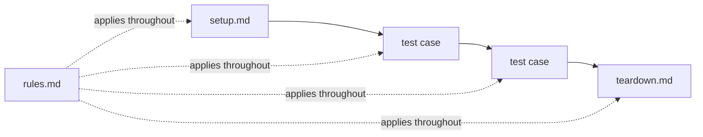

A run walks your selection of tests in **phases**. Each phase is one
autonomous agent execution: read the file, drive the UI through the
[loop](/docs/concepts/how-askui-works#the-loop), write the report as it goes.

**setup.md** establishes the suite's entry criteria first; a failing setup
records the tests it guards as broken — they never execute against a bad
state. **teardown.md** runs last, even after failures. **rules.md** applies
to every phase. In nested suites, setups run top-down, teardowns bottom-up,
and rules accumulate per level. ([Where these files live](/docs/writing-tests/organisation).)

Every phase streams into the [live conversation log](/docs/running-tests#watch-it-live)
and lands in the run's [reports](/docs/results/run-report).

## Why execution differs

A CUA agent is not a script. It reads the screen before every step — like a
human tester following your instructions — and decides how to carry the step
out. Two runs of the same case can take different paths: one run sees a
cookie banner and closes it first; the next doesn't get one. One finds the
button immediately; another scrolls first.

Different execution, same expected result — that is by design. The step's
**expected result is the contract**; the path is only the execution log. It
is also why the same suite survives UI changes that break selector-based
automation.

What this means for how you write and judge tests — precise expected
results, rules that constrain the agent's freedom, judging outcomes rather
than paths — is covered in
[Writing good tests](/docs/best-practices/writing-good-tests#non-deterministic-execution).
