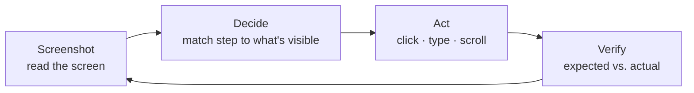

AskUI executes tests with a **Computer Use Agent (CUA)**: an AI agent that
operates real software through the same channel a human tester does — the
screen, the mouse, the keyboard. There is no selector, no recording, no
object map. You write the test in plain language; the agent carries it out.

## The loop

For every step of your test the agent repeats one cycle:

1. **Read** — take a screenshot of the device.
2. **Decide** — interpret your step against what is actually visible, like a
   tester following instructions.
3. **Act** — through a [tool](/docs/extending/tools): click, type, scroll, or
   anything else the toolbox allows.
4. **Verify** — compare the observed result against the step's expected
   result, and record it for the [report](/docs/results/run-report).

Because every decision starts from the live screen, the agent survives UI
changes that break coordinate- or selector-based automation — and it is also
why [two runs can take different paths](/docs/concepts/how-a-run-executes#why-execution-differs).

## The four components

| Component | Role |
| --- | --- |
| **AskUI Desktop** | Where you author, run, and review — [projects](/docs/projects), [devices](/docs/devices), [reports](/docs/results/run-report) |
| **AskUI CLI** | The same runs, headless — [CI and scheduled execution](/docs/running-tests/cli) |
| **AgentOS** | Gives the agent eyes and hands on a machine: screen, keyboard, mouse — [details](/docs/agentos) |
| **AskUI Hub** | Workspace, members, tokens, billing — [account](/docs/account-billing/workspaces) |

The model doing the "decide" step runs through the AskUI hub by default, or
through [your own model provider](/docs/extending/model-providers).
