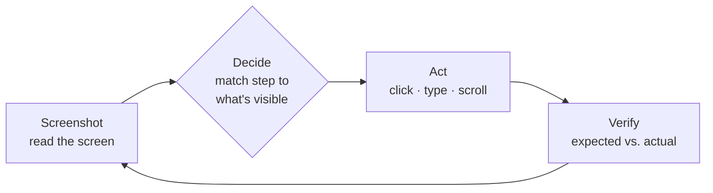

AskUI executes tests with a **Computer Use Agent (CUA)**: an AI agent that
operates real software through the same channel a human tester does — the
screen, the mouse, the keyboard. There is no selector, no recording, no
object map. You write the test in plain language; the agent carries it out.

## How AskUI agents work

For every step of your test the agent repeats one cycle:

1. **Read** — take a screenshot of the device.
2. **Decide** — interpret your step against what is actually visible, like a
   tester following instructions.
3. **Act** — through a [tool](/docs/extending/tools): click, type, scroll, or
   anything else the toolbox allows.
4. **Verify** — compare the observed result against the step's expected
   result, and record it for the [report](/docs/results/run-report).

One cycle as it appears in a run's
[conversation log](/docs/results#conversation-log):

  

    2
    TEST · tests/create_order_test.md
    PASS
    13 tool calls
  

  

    

      Step 2 from the test file — Click "Sign-Up" — the start screen shows the signed-in dot.
    

    

      Screenshot
      
        screenshot
        
          
            
            
            
            Contoso Orders — Sign in
          
          
            
            
            
            
            
              Log in
              Sign-Up
            
          
        
      
    

    

      Decide
      The sign-in page is visible. "Sign-Up" is top right, next to "Log in" — I will click it.
    

    

      Act
      click 1180, 96
    

    

      Verify
      The start screen shows the green signed-in dot top right — the expected result of step 2 is met.
    

    

      Step 4 — Verify order "4711" exists in the backend with status "New". Same cycle, but the truth is not on the screen.
    

    

      Decide
      The order was created in the UI. The step asks me to confirm it in the backend — I will use the HTTP client.
    

    

      Act
      
        http_request GET api.example.com/orders/4711 200 OK
        {'{ "id": "4711", "customer": "Contoso", "status": "New" }'}
      
    

    

      Verify
      The API returns the order with status "New" — the UI and the backend agree.
    

  

The stage labels on the left are this page's four stages; the app itself
shows the narration, the screenshots inline, and the tool-call chips with
their results (plus tokens and latency per step). The cycle is the same whether
the agent acts on the screen or calls a
[tool](/docs/extending/tools) like the HTTP client — only the "act" differs.
Every element of the log: [Runs](/docs/results#conversation-log).

Because every decision starts from the live screen, the agent survives UI
changes that break coordinate- or selector-based automation — and it is also
why [two runs can take different paths](/docs/concepts/how-a-run-executes#why-execution-differs).

## How AskUI makes CUA agents usable

A raw CUA can drive a screen. Turning that into test automation an
enterprise runs every day — on its own machines, inside its own network,
under its own governance — takes four things:

| Component | Role |
| --- | --- |
| **AskUI Desktop** | Where you author, run, and review — [projects](/docs/projects), [devices](/docs/devices), [reports](/docs/results/run-report) |
| **AskUI CLI** | The same runs, headless — [CI and scheduled execution](/docs/running-tests/cli) |
| **AgentOS** | Gives the agent eyes and hands on a machine: screen, keyboard, mouse — [details](/docs/agentos) |
| **AskUI Hub** | Workspace, members, tokens, billing — [account](/docs/account-billing/workspaces) |

What that gives you in an enterprise setting:

- **Your machines, your network** — tests run on the hardware you already
  test on, reachable through your
  [corporate proxy](/docs/troubleshooting/proxy-ssl) and, for the agent's
  own reach, only the tools you
  [enable](/docs/extending/tools).
- **Your model, if you want it** — the "decide" step runs through the AskUI
  hub by default, or through
  [your own provider](/docs/extending/model-providers): an Anthropic key,
  Azure AI Foundry, or your internal gateway behind Microsoft Entra.
- **Your repository** — projects are plain files (tests, prompts,
  configuration), so they live in
  [version control](/docs/projects#git--versioning--sync) and review like code.
- **Your workspace** — members, tokens, and billing are managed in the
  [hub](/docs/account-billing/workspaces).

The full picture of what talks to what, and which data leaves the machine:
[Architecture & data flow](/docs/concepts/architecture-and-data-flow).
