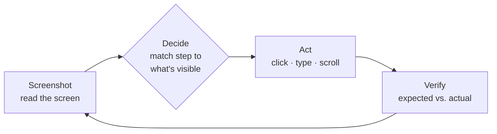

AskUI executes tests with a **Computer Use Agent (CUA)**: an AI agent that
operates real software through the same channel a human tester does — the
screen, the mouse, the keyboard. There is no selector, no recording, no
object map. You write the test as numbered steps in a Markdown file — the
same wording you would hand a colleague — and the agent carries it out.

## The loop

For every step of your test the agent repeats this cycle — often several
times, until the step's expected result is reached or its attempts run out:

1. **Screenshot** — read the screen of the device.
2. **Decide** — interpret your step against what is actually visible, like a
   tester following instructions.
3. **Act** — through a [tool](/docs/extending/tools): click, type, scroll, or
   anything else the toolbox allows.
4. **Verify** — compare what happened against the step's expected result. If
   it matches, the step gets its status and the agent moves on; if not, it
   loops again (within its
   [attempt limit](/docs/best-practices/agent-behavior#system-capabilities--error-discipline)).
   Either way it lands in the [report](/docs/results/run-report).

## One cycle in the conversation log

The same cycle as the app records it —
[the log](/docs/results#conversation-log) is where you watch it happen:

  

    2
    TEST · tests/create_order_test.md
    PASS
    13 tool calls
  

  

    

      Step 2 from the test file — Click "New order" — the empty order form opens.
    

    

      Screenshot
      
        
          <Lucide name="camera" size={11} />
          Take screenshot
        
        
          
            
            
            
            Contoso Orders — Records
          
          
            
            
            
            
            
              Export
              New order
            
          
        
      
    

    

      Decide
      The Records list is visible. "New order" is top right, next to "Export" — I will click it.
    

    

      Act
      
        <Lucide name="mouse-pointer" size={11} />
        Click
        1180, 96
      
    

    

      Verify
      The empty order form is open — the expected result of step 2 is met.
    

    

      Step 4 — Verify order "4711" exists in the backend with status "New". Same cycle, but the truth is not on the screen.
    

    

      Decide
      The order was created in the UI. The step asks me to confirm it in the backend — I will use the HTTP client.
    

    

      Act
      
        
          <Lucide name="globe" size={11} />
          HTTP client
          <code className="rounded bg-fd-muted px-1 text-[11px]">GET</code>
          api.example.com/orders/4711
          → 200 OK
        
        {'{ "id": "4711", "customer": "Contoso", "status": "New" }'}
      
    

    

      Verify
      The API returns the order with status "New" — the UI and the backend agree.
    

  

The stage labels on the left are this page's four stages; the app itself
shows the narration, the screenshots inline, and the tool-call chips with
their results (plus tokens and latency per step). The cycle is the same whether
the agent acts on the screen or calls a
[tool](/docs/extending/tools) like the HTTP client — only the "act" differs.
Every element of the log: [Runs](/docs/results#conversation-log).

## Why not a script?

A script is written for a finite set of application behaviors: one path
through one version of one application, in one environment. Anything outside
that set fails it — a renamed button, a machine that has drifted since the
test was written, a survey pop-up nobody planned for.

The agent decides from the live screen instead, so it also handles what
nobody wrote down: another application, another environment, a state that
has decayed. A random pop-up costs it a click, not the run. That same
freedom is why
[two runs can take different paths](/docs/concepts/how-a-run-executes#why-execution-differs).

## What a CUA agent is made of

Four parts — two you choose, two we provide:

- **A CUA model** — the intelligence, and the part you pay per token for.
  It receives the screenshot and the step text and answers with the next
  action, so it must be **vision-capable**: a text-only model can't see the
  screen. Either you consume it through us (billed with your AskUI
  workspace) or you bring
  [your own provider](/docs/extending/model-providers#supported-models) and
  pay that vendor directly. Which model you pick drives both the run's cost
  and how reliably it reads your UI.
- **Tools** — everything the agent *can* do, and the boundary of what a test
  can possibly do. We ship most of them: the device tools (screenshot,
  click, type) come with the device kind, and the
  [Tool Store](/docs/extending/tools) adds ready-made ones like SQL, HTTP or
  screen zoom. You extend from there where your product needs it — your own
  C# [custom tools](/docs/extending/custom-tools), or existing
  [MCP servers](/docs/extending/mcp) — and you decide which of them a
  project actually gets.
- **AskUI Desktop & AgentOS** — the infrastructure layer you don't have to
  build yourself. [AgentOS](/docs/agentos) gives the agent eyes and hands on
  a machine (Playwright covers browsers, adb covers Android), turning
  "click 1180, 96" into a real click on a real machine — across operating
  systems, remote machines, emulators and physical phones, with connection,
  sessions and screen capture already solved. AskUI Desktop is where you
  author tests, [connect devices](/docs/devices), start runs and read the
  results.
- **A test automation harness** — everything around the model that turns it
  into a tester: the plumbing a test framework normally gives you, adapted to
  an agent. This is the part AskUI provides, and it decides how disciplined a
  run is:
  - **The loop** — screenshot, decide, act, verify, repeat, as above.
  - **Prompt assembly** — your
    [prompt files](/docs/best-practices/agent-behavior) plus the current
    test's steps, the folder's rules, and the names of available
    [secrets](/docs/extending/secrets), stitched into the instructions the
    model sees.
  - **The conversation** — the running transcript of screenshots, decisions
    and tool results. It is the agent's memory, re-sent on every turn, which
    makes it the run's evidence *and* its cost — the reason tools should
    [return little](/docs/extending/custom-tools#keep-results-small).
  - **Stop conditions** — two attempts per step and no creative retries, so
    a `PASSED` means the step actually passed; an infrastructure error ends
    the run as `BROKEN` instead of grinding on.
  - **The run lifecycle** — setup, the tests, teardown per folder, and the
    [report](/docs/results/run-report) written while it all happens
    ([details](/docs/concepts/how-a-run-executes)).

Next: how a whole run walks setup, tests and teardown
([Test automation harness](/docs/concepts/how-a-run-executes)), how to write steps
this loop executes reliably
([Writing good tests](/docs/best-practices/writing-good-tests)), and where
the pieces sit in your network
([Architecture & data flow](/docs/concepts/architecture-and-data-flow)).
