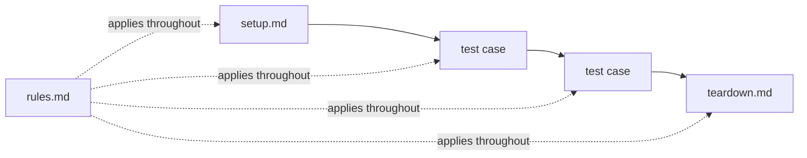

The model decides; the **AskUI harness** runs the test. It is what a test
framework would otherwise be, built for an agent: it walks your selection in
**phases**, assembles what the agent is told for each one, holds the limits
that stop a run from grinding, and writes the reports
([where it sits](/docs/concepts/computer-use-agent#what-a-cua-agent-is-made-of)).

A **phase** is one of `setup.md`, a test case, or `teardown.md`, and one
autonomous agent execution: read the file, drive the UI through the
[loop](/docs/concepts/computer-use-agent#the-loop), write the report as it
goes. Nothing is shared between phases except what you deliberately hand
across, which is what keeps one test from poisoning the next.

## Where the tester's time goes

With scripted automation, most of the effort goes into keeping the scripts
alive: locators that moved, waits that were too short, reruns to tell flake
from defect. That layer is gone here, nothing in a test encodes the UI's
structure, so there is nothing to repair when the UI changes.

The time moves to the part that actually needs a tester: reading the
[report](/docs/results/run-report), judging whether the behavior was right,
and writing up the defect with the evidence attached. For an organization
that is the real shift, automation cost stops scaling with UI churn, and
testing capacity goes into coverage and analysis instead of maintenance.
Where that time is best spent:
[Analyzing failures](/docs/best-practices/analyzing-failures).

That only holds if a run is cheap, trustworthy and fast, which is what a CUA
model left to itself is not. The three things the harness is built for:

- **Token efficiency**: every turn re-sends the conversation, so the harness
  keeps it small: a fresh transcript per phase instead of one growing
  transcript per run, the stable parts of the prompt and the tool
  definitions cached between turns, screenshots downscaled before they are
  sent, and tool results kept short by design (the SQL tool pages at 20 rows
  rather than dumping a table).
- **Reliability**: the same instructions assembled the same way for every
  phase, a hard attempt limit instead of endless retrying, one documented
  status vocabulary, and a clean transcript per test so yesterday's failure
  can't influence today's. A `PASSED` means the same thing in every project.
- **Speed**: the agent chains several actions into one model request where
  it can, needs no waits because it reads the screen, and pays the
  compilation cost of your [custom tools](/docs/extending/custom-tools) only
  when their source changed. What's left is mostly model latency, which is
  why the model you pick shows up directly in run duration
  ([performance & cost](/docs/troubleshooting/performance-cost)).

## Phases

**setup.md** establishes the suite's entry criteria first; a failing setup
records the tests it guards as broken, they never execute against a bad
state. **teardown.md** runs last, even after failures. **rules.md** applies
to every phase. In nested suites, setups run top-down, teardowns bottom-up,
and rules accumulate per level. ([Where these files live](/docs/writing-tests/organisation).)

## What the harness owns

What it hands each phase, what it enforces, and what it leaves behind:

- **The project**: everything it reads comes from one folder: the
  [project](/docs/projects). Tests, prompts, procedures, plans, tool
  configuration and device profiles are plain files, so a run is fully
  defined by what is checked into your repository, the same folder produces
  the same run on a colleague's machine or a CI runner.
- **The agent files**: *who* is testing: the four
  [prompt files](/docs/best-practices/agent-behavior) in `prompts/`, the
  agent's identity and error discipline, facts about the machine, knowledge
  of your application, and the report contract. They apply to every phase and
  change rarely.
- **The testware**: *what* is tested: the phase's own file (`setup.md`, a
  test case, `teardown.md`), the folder's
  [`rules.md`](/docs/writing-tests/setup-teardown-rules#rules), any
  [procedures](/docs/writing-tests/procedures) its steps call, and the
  [plan](/docs/writing-tests/plans) that selected it. This is what changes
  per scenario. Steps naming credentials get the
  [secret](/docs/extending/secrets) names, never the values, those
  substitute at execution time.
- **The toolbox**: *what it may do*: device tools for the run's device kind
  plus the [tools you enabled](/docs/extending/tools); a tool whose device
  isn't part of this run is left out with a warning.
- **The limits and the default behavior in error cases**: what happens when
  a step doesn't work out, so a result means the same thing in every project
  ([the discipline](/docs/best-practices/agent-behavior#system-capabilities-error-discipline)):
  - **Two attempts per step**: then stop, no third try, no creative
    workarounds, no navigating back to retry.
  - **The application misbehaved** → the step is `FAILED` and the test
    aborts; remaining steps are not executed against a wrong state.
  - **A precondition wasn't met** → `SKIPPED`. It never ran, so it can't
    count as a failure.
  - **Infrastructure broke** (device connection, session, peripheral) →
    `BROKEN` with a diagnosis hint, and the run aborts instead of grinding
    on against a broken machine.
  - **A referenced tool is missing** → `WARN` if the agent reached the goal
    another way, `BROKEN` if the step depended on it, and the next test
    still runs.
  - **A custom tool doesn't compile** → the run aborts before the first
    step, with the compiler error as the first entry in the log.

  The step-level defaults come from the agent's instructions, so a suite can
  soften them in [`rules.md`](/docs/writing-tests/setup-teardown-rules#rules),
  for example a documented recovery ("restart the scanner and repeat the
  step") instead of a `BROKEN`. The compile abort is not one of them: the
  runner refuses to start.
- **The memory**: one conversation per phase: the agent starts each test
  with a clean transcript, so a previous test can't confuse it. To carry a
  value across phases on purpose, a step tells it to write to the
  [scratchpad](/docs/writing-tests/agents-and-prompts), setup stores the
  order number, a later test reads it.
- **The reporting**: the evidence. Every phase streams into the
  [live conversation log](/docs/running-tests#watch-it-live) while it runs.
  The agent writes its [test report](/docs/results/run-report) as it works, so each step
  carries its interpretation, expected vs. actual and a screenshot; the
  harness adds the run's
  [summary table](/docs/results/run-report#summary-report) that the
  [Dashboard](/docs/results/dashboard) counts, and keeps the
  [conversation log](/docs/results#conversation-log) as the audit trail. All
  of it is Markdown and PNGs under `agent_workspace/`, so CI can archive it
  and a reviewer can read it without the app.

## Why execution differs

A CUA agent is not a script. It reads the screen before every step, like a
human tester following your instructions, and decides how to carry the step
out. Two runs of the same case can take different paths: one run sees a
cookie banner and closes it first; the next doesn't get one. One finds the
button immediately; another scrolls first.

Different execution, same expected result, that is by design, and the
[reason to use an agent at all](/docs/concepts/computer-use-agent#why-not-a-script).
For reading results it means one thing: the step's **expected result is the
contract**, the path is only the execution log.

What this means for how you write and judge tests, precise expected
results, rules that constrain the agent's freedom, judging outcomes rather
than paths, is covered in
[Writing good tests](/docs/best-practices/writing-good-tests#non-deterministic-execution).
