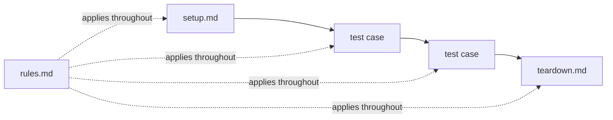

The model decides; the **harness** runs the test. It is the part of AskUI
that a test framework would otherwise be: it walks your selection in
**phases**, assembles what the agent is told for each one, holds the limits
that stop a run from grinding, and writes the reports
([where it sits](/docs/concepts/computer-use-agent#what-a-cua-agent-is-made-of)).

Each phase is one autonomous agent execution: read the file, drive the UI
through the [loop](/docs/concepts/computer-use-agent#the-loop), write the report
as it goes.

**setup.md** establishes the suite's entry criteria first; a failing setup
records the tests it guards as broken — they never execute against a bad
state. **teardown.md** runs last, even after failures. **rules.md** applies
to every phase. In nested suites, setups run top-down, teardowns bottom-up,
and rules accumulate per level. ([Where these files live](/docs/writing-tests/organisation).)

Every phase streams into the [live conversation log](/docs/running-tests#watch-it-live)
and lands in the run's [reports](/docs/results/run-report).

What the harness gives each phase, and what it enforces:

- **The instructions** — the project's
  [prompt files](/docs/best-practices/agent-behavior), the folder's
  `rules.md`, the phase's own file, and the names of the
  [secrets](/docs/extending/secrets) it may use.
- **The toolbox** — device tools for the run's device kind plus the
  [tools you enabled](/docs/extending/tools); a tool whose device isn't part
  of this run is left out with a warning.
- **The limits** — two attempts per step, no creative retries, and an
  infrastructure error ends the run as `BROKEN` rather than continuing
  against a broken machine
  ([the discipline](/docs/best-practices/agent-behavior#system-capabilities--error-discipline)).
- **The memory** — one conversation per phase: the agent starts each test
  with a clean transcript, so a previous test can't confuse it. To carry a
  value across phases on purpose, a step tells it to write to the
  [scratchpad](/docs/writing-tests/agents-and-prompts) — setup stores the
  order number, a later test reads it.

## Why execution differs

A CUA agent is not a script. It reads the screen before every step — like a
human tester following your instructions — and decides how to carry the step
out. Two runs of the same case can take different paths: one run sees a
cookie banner and closes it first; the next doesn't get one. One finds the
button immediately; another scrolls first.

Different execution, same expected result — that is by design, and the
[reason to use an agent at all](/docs/concepts/computer-use-agent#why-not-a-script).
For reading results it means one thing: the step's **expected result is the
contract**, the path is only the execution log.

What this means for how you write and judge tests — precise expected
results, rules that constrain the agent's freedom, judging outcomes rather
than paths — is covered in
[Writing good tests](/docs/best-practices/writing-good-tests#non-deterministic-execution).
