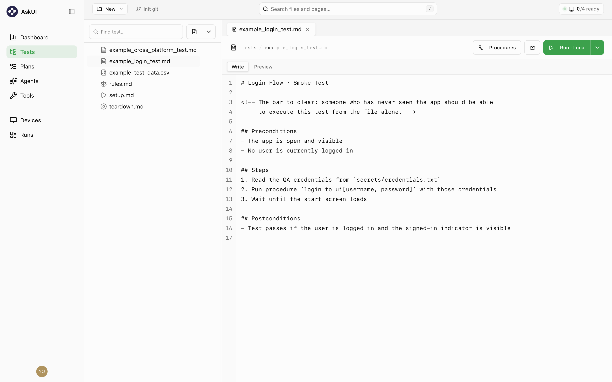
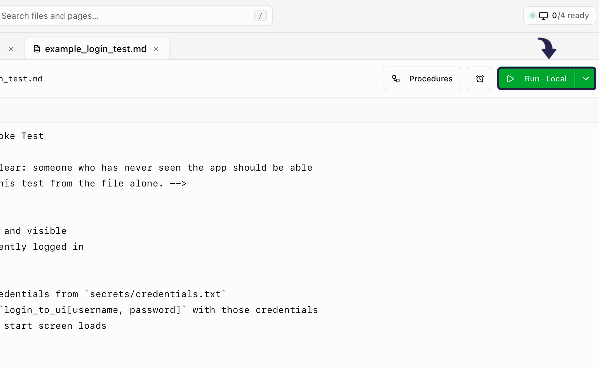

Let's run a test end to end. This assumes you've
[installed AskUI Desktop](/docs/get-started/install-desktop) and
[signed in](/docs/get-started/onboarding).

<Steps>
<Step>
**Create a Project.** After signing in, you'll see a "No project open"
screen with three ways to start:

- **Open folder**: use an existing folder as your project root.
- **Start from template**: pick a folder location and get it pre-filled
  with example tests, prompts, and procedures.
- **Clone from Git**: enter a repository URL, then pick where to clone it.

<Callout title="Tip">
New to AskUI? **Start from template** is the easiest way in: it scaffolds
`tests/`, `prompts/`, `procedures/`, `plans/`, and `secrets/` for you,
pre-seeded with an example login test and the four prompt parts. Not sure
what a filled-in Project should look like? See the
[AskUI Demo Project](https://github.com/askui/AskUI-Demo-Project) on GitHub
for a real example.
</Callout>
</Step>
<Step>
**Fill in `ui_information.md`.** This is the file you'll invest the most in.
Tell the agent about your app:

- Its primary screens
- How to tell it's signed in
- Any dialog quirks

The template ships with placeholders for this (sample Navigation, State
indicators, and Dialogs & quirks sections), replace them with your own
app's details.

See [Agents & prompts](/docs/using-askui-desktop/agents-and-prompts) for the
full breakdown of this and the other three prompt files, and
[Prompting best practices](/docs/using-askui-desktop/prompting-best-practices)
for how to structure them well.

</Step>
<Step>
**Open the example tests** in `tests/`. The template includes more than one:

- **`example_login_test.md`**: a login smoke test.
- **`example_cross_platform_test.md`**: a cross-platform example, marked
  with a `platforms:` line so it only runs on a Cross-platform device
  profile.
- **`example_test_data.csv`**: structured test data.

Alongside them sit `rules.md`, `setup.md`, and `teardown.md`. See
[How a Project is organized](/docs/using-askui-desktop/project-structure)
for what each one does.

Start with the login test and adjust its steps to your app.

</Step>
<Step>
**Run it.** Click **Run · Local** in the top right of the test file view.
The agent acts on the screen step by step and writes a report with a
screenshot per step.

</Step>
</Steps>

## The result

A finished run looks like this. Open it to step through what the agent did:

<RunEmbed src="/runs/first-test.html" title="Your first AskUI Desktop run" />

<Callout title="Tip">
The report's overall status is the worst of its steps. See
[Reading a run report](/docs/using-askui-desktop/run-report) for the full status
vocabulary.
</Callout>
