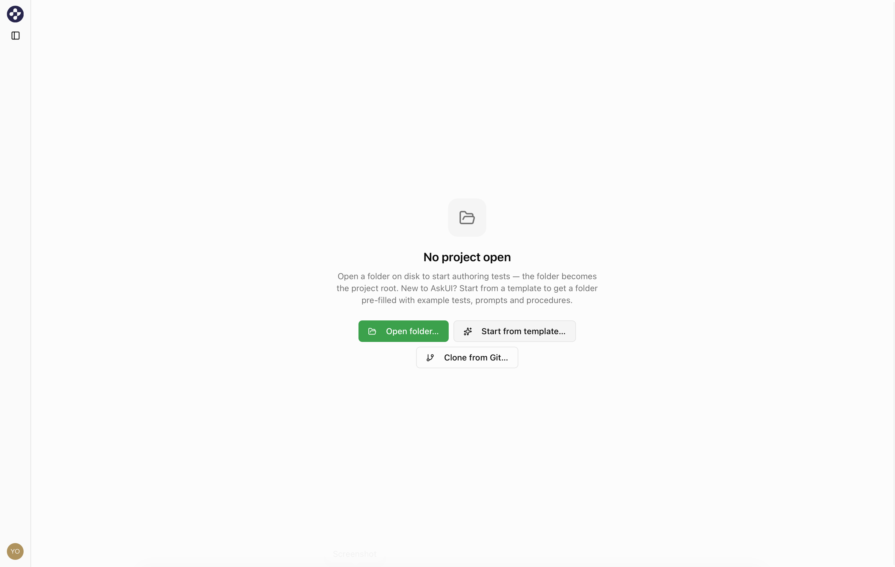
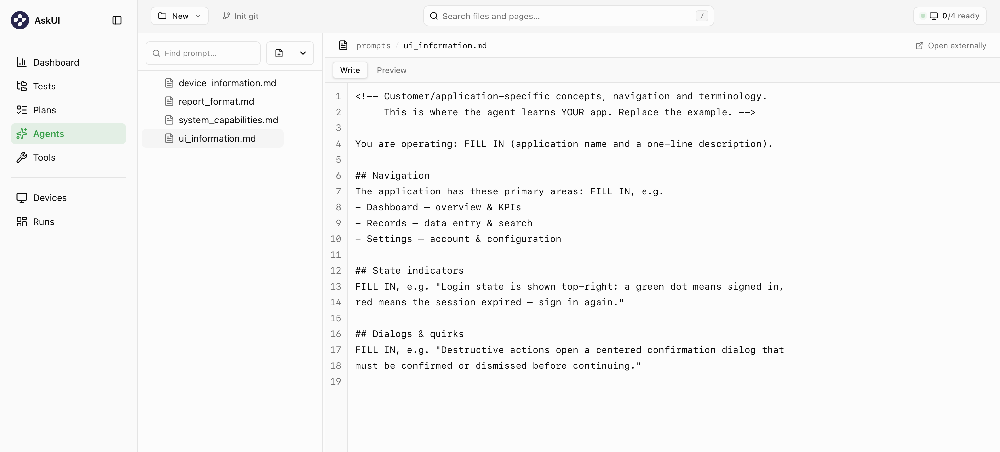

Create a test in plain Markdown, run it on your own machine, and read what the
agent did. This assumes you've
[installed AskUI Desktop](/docs/get-started/install-desktop) and signed in.

## Create and run a test

<Steps>
<Step>
**Open or create a project.** Use the project from the onboarding wizard, or
create a new one from the template. If you land on a "No project open" screen,
it offers three options: **Open folder** (use an existing folder), **Start
from template** (get pre-filled example tests and prompts), or **Clone from
Git** (enter a repository URL).


</Step>
<Step>
**Go to Tests** in the sidebar.
</Step>
<Step>
**Create a test case.** Right-click in the file tree → **New Markdown**, name it
`hello_world.md`, and write the steps in plain language:

```markdown
# Hello World · Smoke Test

## Preconditions
- The desktop is on the home screen

## Steps
1. Open the Notes app.
2. Create a new note.
3. Type "Hello World".

## Postconditions
- Test passes if the note shows the text "Hello World".
```
</Step>
<Step>
**Run it.** With the test open, click **Run · Local**: the agent runs on **this
machine** via the built-in `Local` device profile. (The Run button is a split
button; use its dropdown to pick another device.)
</Step>
</Steps>

---

## Analyse the run

<Steps>
<Step>
**Go to Runs** in the sidebar. The run streams in live and is saved when it
finishes.
</Step>
<Step>
### Conversation log

The **conversation log** is the run's detailed **test execution log**: it shows
how the agent worked through your test case, step by step, like watching a
tester do it and think out loud. It's the same view Live Run shows while a run
is in progress. Here's what the `hello_world` run looks like:

<Tabs items={['Detailed', 'Raw']}>
<Tab value="Detailed">
<div className="overflow-hidden rounded-xl border bg-fd-card text-[13px] shadow-sm">
  <div className="flex items-center gap-3 border-b px-4 py-2.5">
    <span className="text-[13px] font-semibold tracking-tight">Conversation</span>
    <span className="font-mono text-[11px] text-fd-muted-foreground">4 acts · 6 tool calls</span>
    <span className="ml-auto inline-flex items-center gap-1 rounded-full border px-2 py-0.5 text-[11px] font-medium" style={{ color: 'oklch(0.55 0.18 145)', borderColor: 'oklch(0.55 0.18 145 / 0.5)', background: 'oklch(0.55 0.18 145 / 0.08)' }}>▾ Autofollow</span>
    <div className="inline-flex overflow-hidden rounded-md border text-[11px]">
      <span className="px-2.5 py-1 text-fd-muted-foreground">Quiet</span>
      <span className="border-x bg-fd-muted px-2.5 py-1 font-semibold text-fd-foreground">Detailed</span>
      <span className="px-2.5 py-1 text-fd-muted-foreground">Raw</span>
    </div>
  </div>
  <div className="relative py-4 pr-4">
    <div className="pointer-events-none absolute left-[21px] top-8 bottom-9 w-0.5 rounded bg-fd-border" aria-hidden="true" />
    <div className="pointer-events-none absolute left-[18px] bottom-[30px] h-2 w-2 rounded-full bg-fd-border" aria-hidden="true" />
    {/* Act 1 — Setup */}
    <div className="relative mb-6 ml-11">
      <span className="absolute -left-9 top-0 z-10 flex h-7 w-7 items-center justify-center rounded-full border-2 border-fd-border bg-fd-card font-mono text-[10px] font-semibold text-fd-muted-foreground">1</span>
      <div className="flex flex-wrap items-center gap-2">
        <span className="text-[10px] font-bold uppercase tracking-[0.12em]" style={{ color: 'oklch(0.55 0.14 280)' }}>Setup</span>
        <span className="font-mono text-[10.5px] font-normal normal-case text-fd-muted-foreground">· setup.md</span>
        <span className="inline-flex items-center gap-1.5 rounded-full border px-[7px] py-px font-mono text-[10px] font-semibold uppercase tracking-[0.06em]" style={{ color: 'oklch(0.4 0.16 150)', borderColor: 'oklch(0.62 0.16 150 / 0.4)', background: 'oklch(0.97 0.04 150 / 0.6)' }}><span className="h-1.5 w-1.5 rounded-full bg-current" />Pass</span>
      </div>
      <p className="mt-1 text-[14px] leading-snug text-fd-foreground">Ensure the desktop is on the home screen.</p>
    </div>
    {/* Act 2 — Test */}
    <div className="relative mb-6 ml-11">
      <span className="absolute -left-9 top-0 z-10 flex h-7 w-7 items-center justify-center rounded-full border-2 bg-fd-muted font-mono text-[10px] font-semibold text-fd-foreground" style={{ borderColor: 'var(--color-fd-muted-foreground)' }}>2</span>
      <div className="flex flex-wrap items-center gap-2">
        <span className="text-[10px] font-bold uppercase tracking-[0.12em]" style={{ color: 'oklch(0.55 0.14 280)' }}>Test</span>
        <span className="font-mono text-[10.5px] font-normal normal-case text-fd-muted-foreground">· tests/hello_world.md</span>
        <span className="inline-flex items-center gap-1.5 rounded-full border px-[7px] py-px font-mono text-[10px] font-semibold uppercase tracking-[0.06em]" style={{ color: 'oklch(0.4 0.16 150)', borderColor: 'oklch(0.62 0.16 150 / 0.4)', background: 'oklch(0.97 0.04 150 / 0.6)' }}><span className="h-1.5 w-1.5 rounded-full bg-current" />Pass</span>
        <span className="inline-flex items-center gap-2 rounded border border-fd-border bg-fd-muted px-[7px] py-px font-mono text-[10.5px] text-fd-muted-foreground"><strong className="font-semibold text-fd-foreground">5</strong> calls</span>
      </div>
      <p className="mt-1 text-[14px] leading-snug text-fd-foreground">Open the Notes app and type "Hello World".</p>
      <div className="mt-2 flex gap-2.5 text-[12px] text-fd-muted-foreground">
        <span className="shrink-0 pt-0.5 text-[9.5px] font-bold uppercase tracking-[0.1em] text-fd-muted-foreground">Expected</span>
        <span>The note shows "Hello World".</span>
      </div>
      <div className="mt-3 flex flex-col gap-0.5">
        <div className="relative py-1 text-[13px] leading-snug text-fd-foreground">
          <span className="absolute -left-[25px] top-[10px] h-1.5 w-1.5 rounded-full bg-fd-border" />
          I'll open Notes from the Start menu, create a note, and type the text.
        </div>
        <div className="relative flex flex-wrap items-center gap-2.5 py-1">
          <span className="absolute -left-[31px] top-[3px] z-10 flex h-[18px] w-[18px] items-center justify-center rounded-full border-[1.5px] border-fd-border bg-fd-card text-[9px]">📷</span>
          <span className="text-[12.5px] font-semibold text-fd-foreground">screenshot</span>
          <span className="font-mono text-[11px] text-fd-muted-foreground">→ captured</span>
          <span className="font-mono text-[10.5px] text-fd-muted-foreground">120ms</span>
        </div>
        <div className="relative flex flex-wrap items-center gap-2.5 py-1">
          <span className="absolute -left-[31px] top-[3px] z-10 flex h-[18px] w-[18px] items-center justify-center rounded-full border-[1.5px] border-fd-border bg-fd-card text-[9px]">🖱️</span>
          <span className="text-[12.5px] font-semibold text-fd-foreground">click</span>
          <span className="rounded border border-fd-border bg-fd-muted px-1.5 py-px font-mono text-[11.5px] text-fd-muted-foreground">134, 174</span>
          <span className="font-mono text-[11px] text-fd-muted-foreground">→ clicked</span>
          <span className="font-mono text-[10.5px] text-fd-muted-foreground">140ms</span>
        </div>
        <div className="relative flex flex-wrap items-center gap-2.5 py-1">
          <span className="absolute -left-[31px] top-[3px] z-10 flex h-[18px] w-[18px] items-center justify-center rounded-full border-[1.5px] border-fd-border bg-fd-card text-[9px]">🖱️</span>
          <span className="text-[12.5px] font-semibold text-fd-foreground">click</span>
          <span className="rounded border border-fd-border bg-fd-muted px-1.5 py-px font-mono text-[11.5px] text-fd-muted-foreground">460, 27</span>
          <span className="font-mono text-[11px] text-fd-muted-foreground">→ clicked</span>
          <span className="font-mono text-[10.5px] text-fd-muted-foreground">98ms</span>
        </div>
        <div className="relative flex flex-wrap items-center gap-2.5 py-1">
          <span className="absolute -left-[31px] top-[3px] z-10 flex h-[18px] w-[18px] items-center justify-center rounded-full border-[1.5px] border-fd-border bg-fd-card text-[9px]">⌨️</span>
          <span className="text-[12.5px] font-semibold text-fd-foreground">type</span>
          <span className="rounded border border-fd-border bg-fd-muted px-1.5 py-px font-mono text-[11.5px] text-fd-muted-foreground">Hello World</span>
          <span className="font-mono text-[11px] text-fd-muted-foreground">→ typed</span>
          <span className="font-mono text-[10.5px] text-fd-muted-foreground">210ms</span>
        </div>
        <div className="relative flex flex-wrap items-center gap-2.5 py-1">
          <span className="absolute -left-[31px] top-[3px] z-10 flex h-[18px] w-[18px] items-center justify-center rounded-full border-[1.5px] border-fd-border bg-fd-card text-[9px]">📷</span>
          <span className="text-[12.5px] font-semibold text-fd-foreground">screenshot</span>
          <span className="font-mono text-[11px] text-fd-muted-foreground">→ captured</span>
        </div>
        
        <div className="relative py-1 text-[13px] leading-snug text-fd-foreground">
          <span className="absolute -left-[25px] top-[10px] h-1.5 w-1.5 rounded-full bg-fd-border" />
          The note shows "Hello World": step verified.
        </div>
      </div>
    </div>
    {/* Act 3 — Teardown */}
    <div className="relative mb-6 ml-11">
      <span className="absolute -left-9 top-0 z-10 flex h-7 w-7 items-center justify-center rounded-full border-2 border-fd-border bg-fd-card font-mono text-[10px] font-semibold text-fd-muted-foreground">3</span>
      <div className="flex flex-wrap items-center gap-2">
        <span className="text-[10px] font-bold uppercase tracking-[0.12em]" style={{ color: 'oklch(0.55 0.14 280)' }}>Teardown</span>
        <span className="font-mono text-[10.5px] font-normal normal-case text-fd-muted-foreground">· teardown.md</span>
        <span className="inline-flex items-center gap-1.5 rounded-full border px-[7px] py-px font-mono text-[10px] font-semibold uppercase tracking-[0.06em]" style={{ color: 'oklch(0.4 0.16 150)', borderColor: 'oklch(0.62 0.16 150 / 0.4)', background: 'oklch(0.97 0.04 150 / 0.6)' }}><span className="h-1.5 w-1.5 rounded-full bg-current" />Pass</span>
      </div>
      <p className="mt-1 text-[14px] leading-snug text-fd-foreground">Close the Notes app without saving.</p>
      <div className="mt-3 flex flex-col gap-0.5">
        <div className="relative flex flex-wrap items-center gap-2.5 py-1">
          <span className="absolute -left-[31px] top-[3px] z-10 flex h-[18px] w-[18px] items-center justify-center rounded-full border-[1.5px] border-fd-border bg-fd-card text-[9px]">🖱️</span>
          <span className="text-[12.5px] font-semibold text-fd-foreground">click</span>
          <span className="rounded border border-fd-border bg-fd-muted px-1.5 py-px font-mono text-[11.5px] text-fd-muted-foreground">1884, 21</span>
          <span className="font-mono text-[11px] text-fd-muted-foreground">→ clicked</span>
          <span className="font-mono text-[10.5px] text-fd-muted-foreground">88ms</span>
        </div>
      </div>
    </div>
    {/* Act 4 — Upcoming (predicted next step) */}
    <div className="relative ml-11">
      <span className="absolute -left-9 top-0 z-10 flex h-7 w-7 items-center justify-center rounded-full border-2 border-dashed border-fd-border bg-fd-card font-mono text-[10px] font-semibold text-fd-muted-foreground">4</span>
      <div className="flex flex-wrap items-center gap-2">
        <span className="text-[10px] font-bold uppercase tracking-[0.12em] text-fd-muted-foreground">Upcoming</span>
        <span className="font-mono text-[10.5px] font-normal normal-case text-fd-muted-foreground">· tests/save_note.md</span>
        <span className="inline-flex items-center gap-1.5 rounded-full border border-dashed border-fd-border bg-fd-muted px-[7px] py-px font-mono text-[10px] font-semibold uppercase tracking-[0.06em] text-fd-muted-foreground"><span className="h-1.5 w-1.5 rounded-full bg-current" />Pending</span>
      </div>
      <p className="mt-1 text-[14px] italic leading-snug text-fd-muted-foreground">Next: save the note and reopen it to confirm the text persists.</p>
    </div>
  </div>
</div>
</Tab>
<Tab value="Raw">

```json
[
  { "role": "user",      "content": { "type": "act", "kind": "setup", "file": "setup.md" } },
  { "role": "user",      "content": { "type": "act", "kind": "test", "file": "tests/hello_world.md" } },
  { "role": "assistant", "content": { "type": "text", "text": "I'll open Notes, create a note, and type the text." } },
  { "role": "assistant", "content": { "type": "tool_use", "name": "click", "input": { "x": 134, "y": 174 } } },
  { "role": "user",      "content": { "type": "tool_result", "content": "clicked" } },
  { "role": "assistant", "content": { "type": "tool_use", "name": "type", "input": { "text": "Hello World" } } },
  { "role": "user",      "content": { "type": "tool_result", "content": "typed" } },
  { "role": "assistant", "content": { "type": "text", "text": "The note shows 'Hello World': step verified." } },
  { "role": "user",      "content": { "type": "act", "kind": "teardown", "file": "teardown.md" } },
  { "role": "assistant", "content": { "type": "tool_use", "name": "click", "input": { "x": 1884, "y": 21 } } },
  { "role": "user",      "content": { "type": "tool_result", "content": "clicked" } }
]
```

</Tab>
</Tabs>

Follow it top to bottom, like watching over a colleague's shoulder:

The run starts with **① Setup, ② Test, ③ Teardown**: the same three phases you
know from any test run, each a numbered block with a **Pass / Fail** badge. In
our run, act ① put the desktop into the starting state, then act ② picked up
`hello_world.md`.

Inside act ②, the agent first **tells you its plan** in plain language: *"I'll
open Notes from the Start menu, create a note, and type the text."* These text
lines are the agent thinking out loud; read them like a colleague narrating
their work.

Then it **acts on the screen**: the smaller rows, its *tool calls*. It takes a
**screenshot** to see the desktop, **clicks** at position `134, 174` (where it
spotted the Notes icon; the agent works in screen coordinates, like a human
aiming the mouse), clicks again for a new note, and **types** `Hello World`.
Every tool call shows its result (`→ clicked`); a failed one turns red with the
error.

Then it **checks its work**: a final screenshot, expanded so you see exactly
what the agent saw, and its conclusion, *"The note shows Hello World: step
verified."* That screenshot is your proof the pass is real.

Act ③ cleans up (closing Notes), and the dashed **④ Upcoming** row at the bottom
is the agent **predicting its next step**. During a live run you always see
where it's heading before it gets there.

If it's too much detail, switch from **Detailed** to **Quiet** for just the
phases; **Raw** shows the underlying data. **Autofollow** keeps the view pinned
to what the agent is doing right now.
</Step>
<Step>
### Test report

Where the conversation log is the **test execution log**, the report is the
**test execution report**: the structured record of one test case, its
result, the evidence behind it, and any deviations. It follows the shape you
know from manual test documentation. Here's the report for the `hello_world`
run:

<Tabs items={['Rendered', 'Markdown source']}>
<Tab value="Rendered">
<div className="rounded-lg border bg-fd-card px-6 py-5 text-sm leading-relaxed">
  <p className="text-xl font-semibold">Test Case Report: hello_world</p>
  <p className="mt-3"><b>Test Case ID:</b> hello_world<br /><b>Date:</b> 2026-07-17<br /><b>Status:</b> <span className="font-semibold text-fd-primary">PASSED</span></p>
  <p className="mt-4 border-b pb-1 text-lg font-semibold">Summary</p>
  <p className="mt-2">The agent opened the Notes app, created a new note, and typed "Hello World". All steps passed; one incident was resolved during execution (see Issues).</p>
  <p className="mt-4 border-b pb-1 text-lg font-semibold">Preconditions</p>
  <p className="mt-2">1. The desktop is on the home screen.</p>
  <p className="mt-4 border-b pb-1 text-lg font-semibold">Test Steps</p>
  <div className="mt-2 flex flex-col gap-4">
    <div>
      <p><b>1. Open the Notes app</b> · Status: <span className="font-semibold text-fd-primary">PASSED</span></p>
      <ul className="mt-1 list-disc pl-6 text-fd-muted-foreground">
        <li><b>Agent Interpretation:</b> Located the Notes icon on the taskbar and clicked it.</li>
        <li><b>Expected:</b> The Notes app opens.</li>
        <li><b>Actual:</b> Notes opened; a "What's new" popup appeared and was dismissed.</li>
      </ul>
    </div>
    <div>
      <p><b>2. Create a new note</b> · Status: <span className="font-semibold text-fd-primary">PASSED</span></p>
      <ul className="mt-1 list-disc pl-6 text-fd-muted-foreground">
        <li><b>Agent Interpretation:</b> Clicked the new-tab button to start an empty note.</li>
        <li><b>Expected:</b> An empty note is focused.</li>
        <li><b>Actual:</b> A new empty tab opened with the cursor in the text area.</li>
      </ul>
    </div>
    <div>
      <p><b>3. Type "Hello World"</b> · Status: <span className="font-semibold text-fd-primary">PASSED</span></p>
      <ul className="mt-1 list-disc pl-6 text-fd-muted-foreground">
        <li><b>Agent Interpretation:</b> Typed the text and took a screenshot to verify.</li>
        <li><b>Expected:</b> The note shows "Hello World".</li>
        <li><b>Actual:</b> The note shows "Hello World".</li>
      </ul>
      
    </div>
  </div>
  <p className="mt-4 border-b pb-1 text-lg font-semibold">Postconditions</p>
  <p className="mt-2">1. The note shows the text "Hello World".</p>
  <p className="mt-4 border-b pb-1 text-lg font-semibold">Issues</p>
  <p className="mt-2">1. A "What's new" popup appeared after launching Notes and blocked the text area. Dismissed it and continued. Consider whether this popup should appear on every launch.</p>
  <p className="mt-4 border-b pb-1 text-lg font-semibold">Conclusion</p>
  <p className="mt-2">All steps passed. Creating and writing a note works as expected; the launch popup was the only deviation.</p>
</div>
</Tab>
<Tab value="Markdown source">

```markdown
# Test Case Report: hello_world

**Test Case ID:** hello_world
**Date:** 2026-07-17
**Status:** PASSED

## Summary

The agent opened the Notes app, created a new note, and typed "Hello World".
All steps passed; one incident was resolved during execution (see Issues).

## Preconditions

1. The desktop is on the home screen.

## Test Steps

1. **Open the Notes app** · Status: **PASSED**
   - **Agent Interpretation:** Located the Notes icon on the taskbar and clicked it.
   - **Expected:** The Notes app opens.
   - **Actual:** Notes opened; a "What's new" popup appeared and was dismissed.

2. **Create a new note** · Status: **PASSED**
   - **Agent Interpretation:** Clicked the new-tab button to start an empty note.
   - **Expected:** An empty note is focused.
   - **Actual:** A new empty tab opened with the cursor in the text area.

3. **Type "Hello World"** · Status: **PASSED**
   - **Agent Interpretation:** Typed the text and took a screenshot to verify.
   - **Expected:** The note shows "Hello World".
   - **Actual:** The note shows "Hello World".
   - 

## Postconditions

1. The note shows the text "Hello World".

## Issues

1. A "What's new" popup appeared after launching Notes and blocked the text
   area. Dismissed it and continued. Consider whether this popup should appear
   on every launch.

## Conclusion

All steps passed. Creating and writing a note works as expected; the launch
popup was the only deviation.
```

</Tab>
</Tabs>

Section by section:

**Header:** Test case ID, execution date, overall status: your at-a-glance answer.\
**Summary:** The result in one or two sentences. Start here.\
**Preconditions:** The entry criteria the agent verified before executing. This rules out an environment problem in disguise.\
**Test Steps:** Per step: status, **expected vs. actual result**, screenshot as evidence. This is where you localize which step diverged.\
**Postconditions:** The exit state the test asserted.\
**Issues:** Your incident log: deviations the agent hit during execution, including ones it resolved itself, like the "What's new" popup above, an unexpected dialog, or leftover data it had to delete first. A test can be `PASSED` and still list issues, and they often point at real findings a green checkmark would hide. Review this section even when everything is green.\
**Conclusion:** The overall result and its justification.

Five statuses exist, for steps and for the test overall. The test takes the
worst status of its steps:

**`PASSED`**: the actual result matched the expected one. The agent never bends
a test to reach a pass.\
**`WARN`**: passed, but with a caveat worth your attention (slow response, minor
visual deviation).\
**`FAILED`**: the step executed, but the actual result didn't match the
expected one.\
**`SKIPPED`**: intentionally not executed, e.g. a precondition wasn't met.\
**`BROKEN`**: couldn't execute at all: a crash or an infrastructure problem,
not a functional result.

For details and the cross-run summary report, see
[Reading a run report](/docs/using-askui-desktop/run-report).

And when the log or report shows the agent got something wrong (clicked the
wrong element, misread a screen, drew the wrong conclusion), you don't debug
code, you **teach it**: sharpen the wording of the test case, add a rule, or
give it the missing knowledge in the prompts. How test cases, rules, and
prompts work together is covered in
[Prompting best practices](/docs/guides/prompting-best-practices).
{/* TODO: retarget this link to the Concepts section once it exists. */}
</Step>
</Steps>

<Callout title="Make it yours">
Once the example passes, open `prompts/ui_information.md` and describe your own
app: its main screens, how to tell you're signed in, and any quirks. It's the
single most important file for reliable runs. The template ships with
placeholders showing the kind of detail to include (sample Navigation, State
indicators, and Dialogs & quirks sections) to replace with your own app's
details. See [Prompting best practices](/docs/guides/prompting-best-practices).


</Callout>
