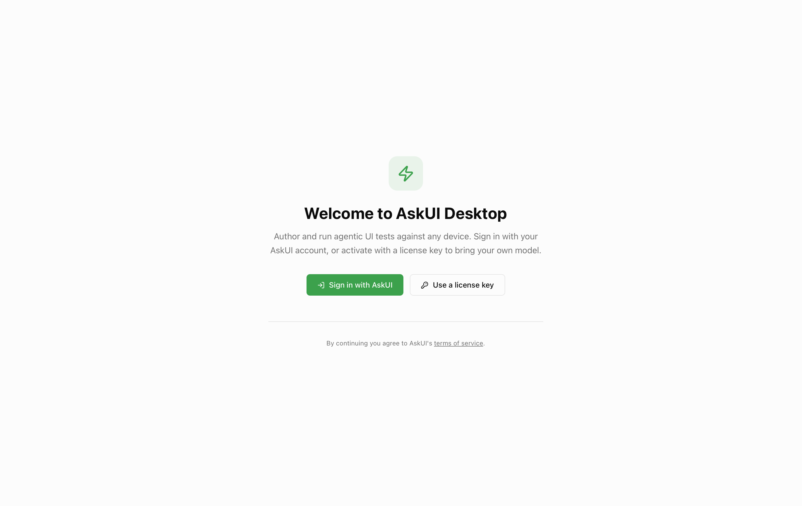

AskUI Desktop is the local host for authoring and running AI-driven UI tests.
It runs on Windows and macOS.

<Steps>

<Step>
**Download the installer** for your platform from [askui.com/download](https://www.askui.com/download).
</Step>

<Step>
**Run the installer** and follow the guided setup.

<Tabs items={['Windows', 'macOS']}>
  <Tab value="Windows">
    Run the `.exe` and accept the prompts. AskUI Desktop installs with an
    embedded Python runtime, so no separate Python install is required.
  </Tab>
  <Tab value="macOS">
    Open the `.dmg` and drag AskUI Desktop to Applications. On first launch,
    grant **Accessibility** and **Screen Recording** permissions under
    **System Settings → Privacy & Security** so the agent can read the
    screen and control input.
  </Tab>
</Tabs>
</Step>

<Step>
**Sign in** with your AskUI account. See [Sign in & onboarding](/docs/get-started/onboarding).

</Step>

<Step>
**Open or create a Project** and run [your first test](/docs/get-started/first-run).
</Step>

</Steps>
