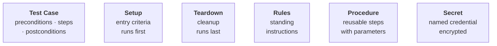

Test cases live as files under `tests/` and are managed on the **Tests**
page: on the left the file tree with all test cases, on the right the editor
with the opened test case and its Run controls.


## The concepts

Six building blocks make up everything you author:



A **suite** frames its test cases with
[setup, teardown, and rules](/docs/writing-tests/setup-teardown-rules); how
suites nest and scope chains is on
[Organisation & scope](/docs/writing-tests/organisation). Cases and setups
call [procedures](/docs/writing-tests/procedures) for repeated sequences,
and reference [secrets](#use-secrets-in-a-test) instead of containing
credentials. [Plans](/docs/writing-tests/plans) select which cases run
together.

## Create a test case

A test case is one file: preconditions, steps with expected results,
postconditions. The file name is the test's name in runs and reports.

1. Right-click in the file tree → **New Markdown** (or **New CSV**).
2. Name the file and fill the seeded template. How to phrase steps well:
   [Writing good tests](/docs/best-practices/writing-good-tests).


The same menu holds everything on this page: creating files and folders, the
quick-create entries for setup / teardown / rules, **Run on**, and
**Duplicate / Rename / Delete**.

### Formats

| Format | Use for |
| --- | --- |
| `.md` | The default — one case per file |
| `.csv` | One case per **row** — data-driven testing |
| `.json` | Exports from a test-management tool run as-is (no fixed schema) |
| `.txt`, `.pdf` | A written or exported specification runs directly |

<Tabs items={['Markdown', 'CSV', 'JSON']}>
<Tab value="Markdown">
```md title="tests/example_login_test.md"
# Login Flow · Smoke Test

## Preconditions
- No user is currently logged in

## Steps
1. Run procedure `login_to_ui[username, password]` with the QA secrets
2. Wait until the start screen loads

## Postconditions
- Test passes if the signed-in indicator is visible
```
</Tab>
<Tab value="CSV">
```csv title="tests/example_test_data.csv"
Test case ID,Test case name,Precondition,Step number,Step description,Expected result
LOGIN_001,Valid login,App is open on the login screen,1,Enter the QA credentials into the login form,Both fields are filled
,,,2,Click the Login button,The start screen is visible and the user is signed in
```
</Tab>
<Tab value="JSON">
```json title="tests/login_001.json"
{
  "id": "LOGIN_001",
  "name": "Valid login",
  "preconditions": ["App is open on the login screen"],
  "steps": [
    { "action": "Enter the QA credentials into the login form", "expected": "Both fields are filled" },
    { "action": "Click the Login button", "expected": "The user is signed in" }
  ]
}
```
</Tab>
</Tabs>

### Target multiple platforms

A first line `platforms: desktop, android` marks a case cross-platform — it
then runs only on a [Cross-platform profile](/docs/devices/cross-platform),
and single-platform tests never run there. The steps name the surface, like
a [multi-computer test](/docs/devices/multi-computer) names machines.

<Callout type="warn" title="Authoring only, for now">
Cross-platform profiles connect and report status, but runs against them are
not supported yet — the case is ready for when they are.
</Callout>

## Use secrets in a test

Never write credentials into a case — reference
[named secrets](/docs/extending/secrets) by name instead. Add the value once
under **Utils → Secrets**; the agent sees only the name, and the real value
is substituted at execution time, redacted from logs and reports:

```md
Sign in with the QA credentials — the secrets named
`QA_USERNAME` and `QA_PASSWORD`.
```

## Run a test case

Pick a connected device in **Run on** and press **Run** — or right-click any
file or folder → **Run on** → a profile. Details in
[Running a test](/docs/running-tests).

## Duplicate, rename, delete — and skip

Right-click the file: **Duplicate** copies a case as a starting point,
**Rename** and **Delete** do what they say. All of it is plain file
operations — visible in Git like any other change to your
[testware](/docs/projects).

There is no skip flag: to leave a case out temporarily, run a
[plan](/docs/writing-tests/plans) that doesn't include it, or move the file
out of `tests/`.
