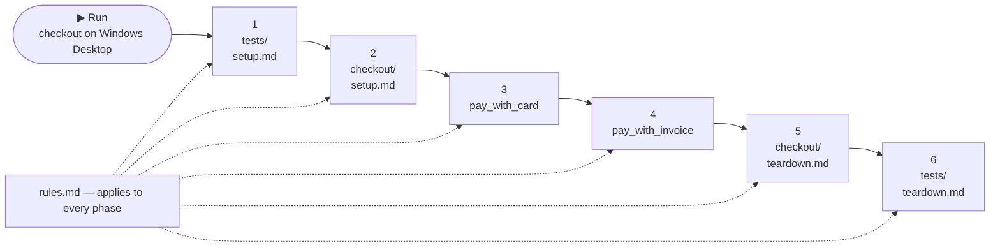

Test cases live as files under `tests/` and are managed on the **Tests**
page: on the left the file tree with all test cases, on the right the editor
with the opened test case and its Run controls.


## How tests/ is organized

Two rules build the whole structure: **a file is a test case, a folder is a
suite** — and suites nest, so the tree mirrors your test structure plan:

<Files>
  <Folder name="tests" defaultOpen>
    <File name="rules.md" />
    <File name="setup.md" />
    <File name="teardown.md" />
    <File name="login_test.md" />
    <File name="user_matrix.csv" />
    <Folder name="checkout" defaultOpen>
      <File name="setup.md" />
      <File name="pay_with_card.md" />
      <File name="pay_with_invoice.md" />
    </Folder>
    <Folder name="user-management" defaultOpen>
      <File name="create_user.md" />
      <File name="delete_user.md" />
    </Folder>
  </Folder>
</Files>

| Entry | What it is |
| --- | --- |
| `login_test.md` | A single test case — the file name is the test's name in runs and reports |
| `user_matrix.csv` | Also test cases — one per row; every [format](/docs/writing-tests#formats) sits side by side in the same tree |
| `checkout/` | A suite: its cases run together, framed by the suite's own `setup.md`. Nest deeper for sub-suites |
| `user-management/` | A sibling suite — no steering files of its own, so only the outer ones apply. Suites are independent: a failing `checkout/setup.md` never touches it |
| `rules.md`, `setup.md`, `teardown.md` | Steering files, allowed at **every** level — each scopes to its folder and everything below ([scope](#scope--which-tests-they-apply-to)) |

**Scope at a glance:** the steering files reach downward, never sideways.
In the tree above, `checkout/pay_with_card.md` runs framed by
`tests/setup.md` *and* `checkout/setup.md`, under the outer `rules.md`;
`user-management/create_user.md` gets only the outer files.

Any level can be a run target: one file, one suite, or the whole tree —
folder structure is also your run granularity.

## Steering files: setup, teardown & rules [#steering-files]

Three conventional files steer how a folder executes. The right-click menu
offers **New setup.md / teardown.md / rules.md** when they're missing; each
seeds a template with `FILL IN` placeholders — replace those, keep the shape.

### Scope — which tests they apply to

Each file scopes to **its folder and everything below it**. With the tree
above, running `checkout/pay_with_card.md` executes:

1. `tests/setup.md` — outer entry criteria first
2. `checkout/setup.md` — the suite's own entry criteria
3. `checkout/pay_with_card.md` — the case, under **both** `rules.md` levels
4. `checkout/teardown.md` — innermost cleanup first
5. `tests/teardown.md` — outer cleanup last

Setups run top-down, teardowns bottom-up, rules accumulate per level — and
this holds even when you run a **single file**: its ancestor folders' setups
and teardowns still frame it. A failing setup blocks exactly the tests below
it; sibling suites are unaffected.

The chain wraps like an onion — each folder level opens before and closes
after everything inside it. Pressing **Run** on the `checkout` suite:



### Setup — runs first

The suite's entry criteria: log in, reset data, open the application. Runs
once, before any case — a failing setup records the suite's cases as broken
instead of executing them against a bad state.

```md title="setup.md"
## Setup Steps

1. FILL IN: open the application under test and wait until it is fully visible.
2. Log in using the `login_to_ui` procedure with the QA username and password secrets.
3. Verify the start screen has loaded before any test starts.
```

### Teardown — runs last

Cleanup after the suite: sign out, delete created records. Runs even after
failures.

```md title="teardown.md"
## Teardown Steps

1. FILL IN: close the application under test.
2. Clear any temporary files created during testing.
```

### Rules — apply throughout

Standing instructions for every phase — not a test, context: interaction
style, error handling, things never to do.

```md title="rules.md"
# Execution rules for this folder

## Interaction
- Use the desktop computer to execute these tests.

## Error handling
- On an infrastructure error (connection lost, session expired): mark the
  testcase BROKEN, write the report, abort.
- On an application error: mark the testcase FAILED and abort.
```

## Procedures

A procedure is a parameterized, reusable block of steps — the same idea as a
keyword in keyword-driven testing. When the login screen changes, you fix
the procedure once; every test that calls it picks the fix up.

**Define it** — a Markdown file in `procedures/` (the **Procedures** button
on the Tests page creates one from a template):

```md title="procedures/login_to_ui.md"
# Login to the UI
# Parameters: [username, password]

1. Enter the value of {username} into the username field
2. Enter the value of {password} into the password field
3. Click the "Login" button
4. The procedure is successful if you are logged in
```

- The **file name** is the name tests call: `login_to_ui`.
- The `# Parameters: [...]` line declares the inputs; steps reference them
  as `{username}`, `{password}`.
- The last step states when the procedure counts as successful.

**Use it** — call it as a single step from any test (or from `setup.md`),
passing arguments in parameter order; a [secret](/docs/extending/secrets)
can be passed by name:

```md
1. Run procedure `login_to_ui[qa_user, {QA_PASSWORD}]`
2. Wait until the start screen loads
```

## Target multiple platforms

A first line `platforms: desktop, android` marks a case cross-platform — it
then runs only on a [Cross-platform profile](/docs/devices/cross-platform),
and single-platform tests never run there. The steps name the surface, like
a [multi-computer test](/docs/devices/multi-computer) names machines:

```md
platforms: desktop, android

# Order hand-off

## Steps
1. On the desktop, read the most recent order number from the orders list.
2. On the Android device, open the companion app and search for that order.
```

<Callout type="warn" title="Authoring only, for now">
Cross-platform profiles connect and report status, but runs against them are
not supported yet — the case is ready for when they are.
</Callout>

## Create a test case

1. Right-click in the file tree → **New Markdown** (or **New CSV**).
2. Name the file and write the case: preconditions, steps with expected
   results, postconditions.


The same menu holds everything on this page: creating files and folders, the
quick-create entries for `setup.md` / `teardown.md` / `rules.md`, **Run on**,
and **Duplicate / Rename / Delete**.

A **New Markdown** file starts from the template — preconditions, steps,
postconditions. How to phrase steps well:
[Writing good tests](/docs/best-practices/writing-good-tests).

### Formats

| Format | Use for |
| --- | --- |
| `.md` | The default — one case per file |
| `.csv` | One case per **row** — data-driven testing |
| `.json` | Exports from a test-management tool run as-is (no fixed schema) |
| `.txt`, `.pdf` | A written or exported specification runs directly |

<Tabs items={['Markdown', 'CSV', 'JSON']}>
<Tab value="Markdown">
```md title="tests/example_login_test.md"
# Login Flow · Smoke Test

## Preconditions
- No user is currently logged in

## Steps
1. Run procedure `login_to_ui[username, password]` with the QA secrets
2. Wait until the start screen loads

## Postconditions
- Test passes if the signed-in indicator is visible
```
</Tab>
<Tab value="CSV">
```csv title="tests/example_test_data.csv"
Test case ID,Test case name,Precondition,Step number,Step description,Expected result
LOGIN_001,Valid login,App is open on the login screen,1,Enter the QA credentials into the login form,Both fields are filled
,,,2,Click the Login button,The start screen is visible and the user is signed in
```
</Tab>
<Tab value="JSON">
```json title="tests/login_001.json"
{
  "id": "LOGIN_001",
  "name": "Valid login",
  "preconditions": ["App is open on the login screen"],
  "steps": [
    { "action": "Enter the QA credentials into the login form", "expected": "Both fields are filled" },
    { "action": "Click the Login button", "expected": "The user is signed in" }
  ]
}
```
</Tab>
</Tabs>

## Run a test case

Pick a connected device in **Run on** and press **Run** — or right-click any
file or folder → **Run on** → a profile. Details in
[Running a test](/docs/running-tests).

## Duplicate, rename, delete — and skip

Right-click the file: **Duplicate** copies a case as a starting point,
**Rename** and **Delete** do what they say. All of it is plain file
operations — visible in Git like any other change to your
[testware](/docs/projects).

There is no skip flag: to leave a case out temporarily, run a
[plan](/docs/writing-tests/plans) that doesn't include it, or move the file
out of `tests/`.

## Use secrets in a test

Never write credentials into a case — reference
[named secrets](/docs/extending/secrets) instead:

```md
Sign in with the QA credentials — the secrets named
`QA_USERNAME` and `QA_PASSWORD`.
```
