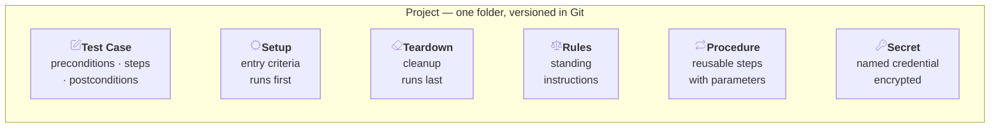

Test cases live as files under `tests/` and are managed on the **Tests**
page: on the left the file tree with all test cases, on the right the editor
with the opened test case and its Run controls.


## The concepts

Six building blocks make up everything you author:


```mermaid
flowchart LR
  subgraph PROJECT["Project — one folder, versioned in Git"]
  direction LR
  TC["<svg style='color:var(--color-fd-foreground,#000)' width='18' height='18' viewBox='0 0 24 24' fill='none' stroke='currentColor' stroke-width='2' stroke-linecap='round' stroke-linejoin='round'><path d='M12 3H5a2 2 0 0 0-2 2v14a2 2 0 0 0 2 2h14a2 2 0 0 0 2-2v-7'/><path d='M18.375 2.625a1 1 0 0 1 3 3l-9.013 9.014a2 2 0 0 1-.853.505l-2.873.84a.5.5 0 0 1-.62-.62l.84-2.873a2 2 0 0 1 .506-.852z'/></svg><b>Test Case</b><br/>preconditions · steps<br/>· postconditions"]
  SETUP["<svg style='color:var(--color-fd-foreground,#000)' width='18' height='18' viewBox='0 0 24 24' fill='none' stroke='currentColor' stroke-width='2' stroke-linecap='round' stroke-linejoin='round'><path d='M11 10.27 7 3.34'/><path d='m11 13.73-4 6.93'/><path d='M12 22v-2'/><path d='M12 2v2'/><path d='M14 12h8'/><path d='m17 20.66-1-1.73'/><path d='m17 3.34-1 1.73'/><path d='M2 12h2'/><path d='m20.66 17-1.73-1'/><path d='m20.66 7-1.73 1'/><path d='m3.34 17 1.73-1'/><path d='m3.34 7 1.73 1'/><circle cx='12' cy='12' r='2'/><circle cx='12' cy='12' r='8'/></svg><b>Setup</b><br/>entry criteria<br/>runs first"]
  TEARDOWN["<svg style='color:var(--color-fd-foreground,#000)' width='18' height='18' viewBox='0 0 24 24' fill='none' stroke='currentColor' stroke-width='2' stroke-linecap='round' stroke-linejoin='round'><path d='M21 21H8a2 2 0 0 1-1.42-.587l-3.994-3.999a2 2 0 0 1 0-2.828l10-10a2 2 0 0 1 2.829 0l5.999 6a2 2 0 0 1 0 2.828L12.834 21'/><path d='m5.082 11.09 8.828 8.828'/></svg><b>Teardown</b><br/>cleanup<br/>runs last"]
  RULES["<svg style='color:var(--color-fd-foreground,#000)' width='18' height='18' viewBox='0 0 24 24' fill='none' stroke='currentColor' stroke-width='2' stroke-linecap='round' stroke-linejoin='round'><path d='M12 3v18'/><path d='m19 8 3 8a5 5 0 0 1-6 0zV7'/><path d='M3 7h1a17 17 0 0 0 8-2 17 17 0 0 0 8 2h1'/><path d='m5 8 3 8a5 5 0 0 1-6 0zV7'/><path d='M7 21h10'/></svg><b>Rules</b><br/>standing<br/>instructions"]
  PROC["<svg style='color:var(--color-fd-foreground,#000)' width='18' height='18' viewBox='0 0 24 24' fill='none' stroke='currentColor' stroke-width='2' stroke-linecap='round' stroke-linejoin='round'><path d='m17 2 4 4-4 4'/><path d='M3 11v-1a4 4 0 0 1 4-4h14'/><path d='m7 22-4-4 4-4'/><path d='M21 13v1a4 4 0 0 1-4 4H3'/></svg><b>Procedure</b><br/>reusable steps<br/>with parameters"]
  SEC["<svg style='color:var(--color-fd-foreground,#000)' width='18' height='18' viewBox='0 0 24 24' fill='none' stroke='currentColor' stroke-width='2' stroke-linecap='round' stroke-linejoin='round'><path d='M2.586 17.414A2 2 0 0 0 2 18.828V21a1 1 0 0 0 1 1h3a1 1 0 0 0 1-1v-1a1 1 0 0 1 1-1h1a1 1 0 0 0 1-1v-1a1 1 0 0 1 1-1h.172a2 2 0 0 0 1.414-.586l.814-.814a6.5 6.5 0 1 0-4-4z'/><circle cx='16.5' cy='7.5' r='.5' fill='currentColor'/></svg><b>Secret</b><br/>named credential<br/>encrypted"]
  TC ~~~ SETUP ~~~ TEARDOWN ~~~ RULES ~~~ PROC ~~~ SEC
  end
```

All of it lives in one [Project](/docs/projects), plain files, shared via
Git. A **suite** frames its test cases with
[setup, teardown, and rules](/docs/writing-tests/setup-teardown-rules); how
suites nest and scope chains is on
[Organisation & Scope](/docs/writing-tests/organisation). Cases and setups
call [procedures](/docs/writing-tests/procedures) for repeated sequences,
and reference [secrets](#use-secrets-in-a-test) instead of containing
credentials. [Test plans](/docs/writing-tests/plans) select which cases run
together, and on which device.

## Create a test case

A test case is one file: preconditions, steps with expected results,
postconditions. The file name is the test's name in runs and reports.

1. Right-click in the file tree → **New Markdown** (or **New CSV**).
2. Name the file and fill the seeded template. How to phrase steps well:
   [Writing good tests](/docs/best-practices/writing-good-tests).


The same menu holds everything on this page: creating files and folders, the
quick-create entries for setup / teardown / rules, **Run on**,
**Copy / Paste**, and **Duplicate / Rename / Delete**.

### Anatomy & formats

Every test case has the same three parts, preconditions, steps,
postconditions, whatever the file format:

<Tabs items={['Markdown', 'CSV', 'JSON']}>
<Tab value="Markdown">
```md title="tests/example_login_test.md"
# Login Flow · Smoke Test

## Preconditions
- No user is currently logged in

## Steps
1. Log in using the `login_to_ui` procedure with the QA secrets
2. Wait until the start screen loads

## Postconditions
- Test passes if the signed-in indicator is visible
```
</Tab>
<Tab value="CSV">
```csv title="tests/example_test_data.csv"
Test case ID,Test case name,Precondition,Step number,Step description,Expected result
LOGIN_001,Valid login,App is open on the login screen,1,Enter the QA credentials into the login form,Both fields are filled
,,2,Click the Login button,The start screen is visible and the user is signed in
```
</Tab>
<Tab value="JSON">
```json title="tests/login_001.json"
{
  "id": "LOGIN_001",
  "name": "Valid login",
  "preconditions": ["App is open on the login screen"],
  "steps": [
    { "action": "Enter the QA credentials into the login form", "expected": "Both fields are filled" },
    { "action": "Click the Login button", "expected": "The user is signed in" }
  ]
}
```
</Tab>
</Tabs>

**Preconditions**: the state the test *assumes*, not work to perform: which
screen is open, which user is logged out, which data exists. The agent
checks them before the first step and records whether they were met; a test
whose preconditions aren't met is reported `SKIPPED` instead of producing a
misleading step failure, because it never ran. Shared preparation work
belongs in [setup](/docs/writing-tests/setup-teardown-rules), not here.

**Steps**: numbered actions, each paired with what to expect. The agent
executes them one at a time: perform the action, compare what it observes
against the step's expected result, record both with a screenshot. Each step
becomes an expected-vs-actual entry in the
[run report](/docs/results/run-report), so a step without an expected
result is a step the report can't judge. Everything a step can express,
conditions, waits, checks, procedure calls, is on
[Step constructs](/docs/writing-tests/step-constructs).

**Postconditions**: the overall pass criterion, phrased as a checkable end
state: "Test passes if …". The agent judges it after the last step,
independent of which path it took to get there. The case's reported status
is the worst of its steps
([how it is derived](/docs/results/run-report#test-report)).

These templates are starting points, not schemas, the agent reads a test
the way a tester would, so you're free to choose your own structure. `.md`
holds one case per file, `.csv` one case per **row** (data-driven testing),
and `.json`, `.txt`, or `.pdf` exports from a test-management tool run
as-is. New to Markdown? The
[Markdown Guide](https://www.markdownguide.org/basic-syntax/) covers the
syntax in ten minutes.

### Target multiple platforms

A first line `platforms: desktop, android` marks a case cross-platform, it
then runs only on a [Cross-platform profile](/docs/devices/cross-platform),
and single-platform tests never run there. The steps name the surface, like
a [multi-computer test](/docs/devices/multi-computer) names machines.

<Callout type="warn" title="Authoring only, for now">
Cross-platform profiles connect and report status, but runs against them are
not supported yet, the case is ready for when they are.
</Callout>

## Use secrets in a test

Never write credentials into a case, reference
[named secrets](/docs/extending/secrets) by name instead. Add the value once
under **Extending → Secrets**; the agent sees only the name, and the real value
is substituted at execution time, redacted from logs and reports:

```md
Sign in with the QA credentials — the secrets named
`QA_USERNAME` and `QA_PASSWORD`.
```

## Run a test case

1. Pick a connected device in **Run on**.
2. Press **Run**, or right-click any file or folder → **Run on** → a
   profile.

Details in [Running a test](/docs/running-tests).

## Manage a test case

All of it is plain file operations via right-click, visible in Git like any
other change to your [testware](/docs/projects).

### Duplicate

1. Right-click the file → **Duplicate**.
2. Rename the copy, it's the starting point for a similar case.

### Copy & paste

Duplicate puts the copy beside the original; copy and paste puts it where
you want it — into another suite, or several cases at once.

1. Select what to copy. <kbd>Ctrl</kbd>/<kbd>⌘</kbd>+click a row to add it
   to the selection, <kbd>Shift</kbd>+click to extend from the last one. A
   folder copies with everything inside it.
2. Right-click → **Copy**, or press <kbd>Ctrl</kbd>/<kbd>⌘</kbd>+<kbd>C</kbd>
   while the tree has focus (click a row first). With nothing selected, the
   shortcut copies the open test.
3. Right-click the target folder → **Paste**, or click a folder (or a file
   in it) and press <kbd>Ctrl</kbd>/<kbd>⌘</kbd>+<kbd>V</kbd>. Pasting onto a
   file pastes into that file's folder.

The tree selects the copies without opening them, so you can rename them
right away. Names stay as they are unless the folder already has one; then
the copy gets ` copy` before the extension, and ` copy 2`, ` copy 3` … after
that — so pasting into the same folder always works
(`login.md` → `login copy.md`).

Two things a paste never does:

- **Rename a steering file.** `setup.md`, `teardown.md`, `rules.md` and
  `ui.md` copy like any file, but a folder holds only one of each, so where
  the target already has one, that file is skipped and a message says so —
  the rest of the paste goes ahead.
- **Touch the system clipboard.** The copied files live in the app; text you
  copied elsewhere stays, and the shortcuts keep their usual meaning while
  you are typing in the editor, the search box or a name.
- **Copy your unsaved edits.** A folder copy takes the files the tree shows.
  Drafts of edits you have not saved, and tooling folders such as `.git`, are
  left behind, so the copy is never dirty on arrival.

Copy and paste is available in the `tests/` tree only.

### Rename

1. Right-click the file → **Rename**.
2. Enter the new name. The file name is the test's name in runs and reports;
   reports of old runs keep the old name.

### Delete

1. Right-click the file → **Delete**.

### Skip

There is no skip flag: to leave a case out temporarily, run a
[test plan](/docs/writing-tests/plans) that doesn't select it, or move the
file out of `tests/`.
