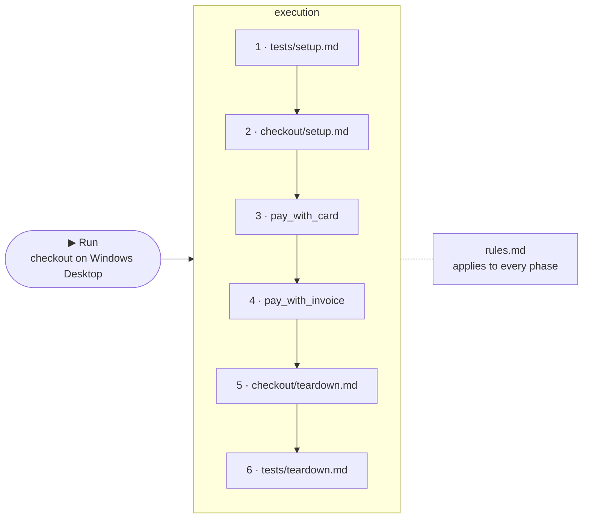

Two rules build the whole structure: **a file is a test case, a folder is a
suite** — and suites nest, so the tree mirrors your test structure plan:

<Files>
  <Folder name="tests" defaultOpen>
    <File name="rules.md" />
    <File name="setup.md" />
    <File name="teardown.md" />
    <File name="login_test.md" />
    <File name="user_matrix.csv" />
    <Folder name="checkout" defaultOpen>
      <File name="setup.md" />
      <File name="pay_with_card.md" />
      <File name="pay_with_invoice.md" />
    </Folder>
    <Folder name="user-management" defaultOpen>
      <File name="create_user.md" />
      <File name="delete_user.md" />
    </Folder>
  </Folder>
</Files>

| Entry | What it is |
| --- | --- |
| `login_test.md` | A single test case — the file name is the test's name in runs and reports |
| `user_matrix.csv` | Also test cases — one per row; every [format](/docs/writing-tests#formats) sits side by side in the same tree |
| `checkout/` | A suite: its cases run together, framed by the suite's own `setup.md`. Nest deeper for sub-suites |
| `user-management/` | A sibling suite — no steering files of its own, so only the outer ones apply. Suites are independent: a failing `checkout/setup.md` never touches it |
| `rules.md`, `setup.md`, `teardown.md` | [Steering files](/docs/writing-tests/setup-teardown-rules), allowed at **every** level — each scopes to its folder and everything below |

## Scope

The steering files reach downward, never sideways. In the tree above,
`checkout/pay_with_card.md` runs framed by `tests/setup.md` *and*
`checkout/setup.md`, under the outer `rules.md`;
`user-management/create_user.md` gets only the outer files. Setups run
top-down, teardowns bottom-up — pressing **Run** on the `checkout` suite:

A failing setup blocks exactly the tests below it; sibling suites are
unaffected. Any level can be a run target: one file, one suite, or the whole
tree — folder structure is also your run granularity.
