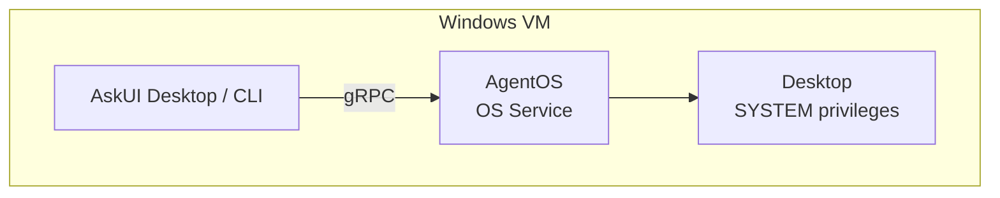
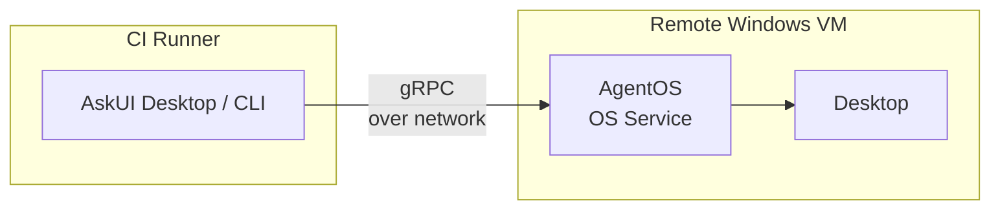
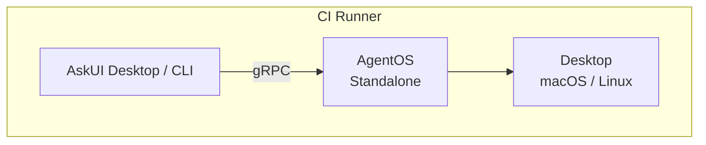
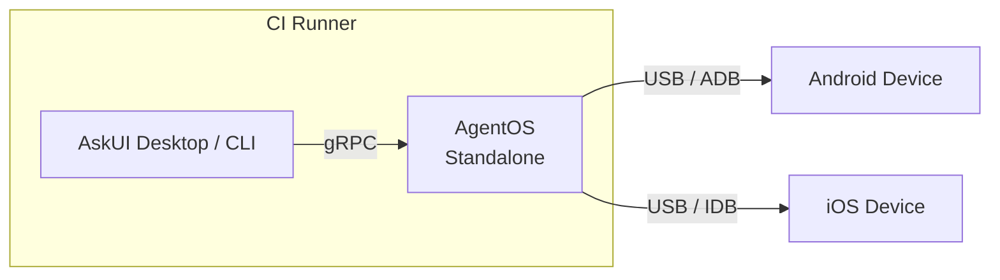

import { Aside, Steps, Tabs, TabItem } from '@astrojs/starlight/components';

You're running agents unattended in a pipeline or on remote infrastructure. The install method depends on whether you need OS service capabilities (RDP resilience, SYSTEM privileges) or standalone mode is sufficient.

## Windows VM

Run automation directly on a Windows VM that is part of your CI/CD pipeline. AgentOS runs as an OS service with SYSTEM privileges.

**When to use:** Your CI runner *is* the Windows machine you want to automate.

**Install:** [Service](/agentos/installation/service/) on the VM.



AskUI Desktop or the CLI and AgentOS both run on the same VM. The OS service ensures automation continues even if no user is logged in or the RDP session disconnects.

## Remote Windows VM

Automate a Windows VM from a separate CI runner. AskUI Desktop or the CLI runs on the CI runner and connects to AgentOS on the remote VM over the network.

**When to use:** Your CI runner is Linux/macOS but you need to automate a Windows desktop. Or your pipeline orchestrates work across multiple machines.

**Install:** [Service](/agentos/installation/service/) on the remote VM.

<Aside type="caution">
During installation, set **Connection Scope** to **Public (0.0.0.0)**. The default Private (127.0.0.1) only accepts local connections and will prevent the client from reaching AgentOS over the network.
</Aside>



The client connects to AgentOS over the network via gRPC. The OS service on the remote VM handles desktop control independently — RDP disconnects, logon screens, and headless operation are all supported.

<details>
<summary>Connecting to a remote AgentOS</summary>

By default, AskUI Desktop and the CLI start a local AgentOS instance. To connect to a remote VM instead, disable autostart and point the client to the remote address.

<Steps>

1. **Disable local autostart**

   Set `ASKUI_CONTROLLER_CLIENT_SERVER_AUTOSTART` to `false` so the client doesn't start a local AgentOS instance.

   <Tabs>
     <TabItem label="Windows PowerShell">
       ```powershell
       $env:ASKUI_CONTROLLER_CLIENT_SERVER_AUTOSTART="false"
       ```
     </TabItem>
     <TabItem label="macOS/Linux">
       ```bash
       export ASKUI_CONTROLLER_CLIENT_SERVER_AUTOSTART=false
       ```
     </TabItem>
   </Tabs>

2. **Set the remote address**

   Point `ASKUI_CONTROLLER_CLIENT_SERVER_ADDRESS` to the AgentOS service on the remote VM. Replace `192.168.1.100` with your VM's IP address.

   <Tabs>
     <TabItem label="Windows PowerShell">
       ```powershell
       $env:ASKUI_CONTROLLER_CLIENT_SERVER_ADDRESS="192.168.1.100:26000"
       ```
     </TabItem>
     <TabItem label="macOS/Linux">
       ```bash
       export ASKUI_CONTROLLER_CLIENT_SERVER_ADDRESS=192.168.1.100:26000
       ```
     </TabItem>
   </Tabs>

3. **Verify the connection**

   Run your agent. The client should connect to the remote AgentOS instance instead of starting a local one. Check that the remote VM's port `26000` is reachable from your CI runner.

</Steps>

</details>

## macOS / Linux CI Runner

Run automation on a macOS or Linux CI runner. AgentOS runs in standalone mode.

**When to use:** Your CI pipeline runs on macOS or Linux and you want to automate the desktop on that same runner.

**Install:** `pip install askui-agent-os`



Same as local development — AgentOS runs in standalone mode alongside your test code. Ensure the CI runner has a display (real or virtual) available.

## Mobile Device in CI

Automate Android or iOS devices connected to your CI runner via USB.

**When to use:** Mobile testing in your pipeline — the device is physically connected to the CI runner.

**Install:** `pip install askui-agent-os` on the CI runner.



AgentOS runs on the CI runner and communicates with the connected device over USB. The CI runner needs physical USB access to the device (or a USB-over-network solution).

### Android: Setting up ADB

ADB (Android Debug Bridge) must be available on your PATH. ADB works with both physical devices and emulators. See Google's guide on [running apps on the Android Emulator](https://developer.android.com/studio/run/emulator) to get started with emulators.

<Steps>

1. **Download SDK Platform Tools**

   Download from [developer.android.com](https://developer.android.com/tools/releases/platform-tools) and unzip to a folder (e.g. `C:\platform-tools` or `~/platform-tools`).

2. **Add to PATH**

   Add the unzipped folder to your **User** or **System PATH** environment variable.

3. **Verify**

   Open a new terminal and run:
   ```bash
   adb version
   ```
   You should see the ADB version output.

</Steps>

### iOS: Setting up IDB (macOS only, experimental)

iOS automation requires macOS with Xcode and the Facebook IDB companion. IDB currently only works with **iOS Simulators**, not physical devices. This feature is **experimental**. See Apple's guide on [running your app in Simulator](https://developer.apple.com/documentation/xcode/running-your-app-in-simulator-or-on-a-device) to get started.

<Steps>

1. **Install Xcode with iOS Simulators**

   Install [Xcode](https://developer.apple.com/xcode/) from the App Store and configure iOS Simulators. Verify they are visible:
   ```bash
   xcrun xctrace list devices
   ```

2. **Install IDB companion**

   ```bash
   brew tap facebook/fb
   brew install idb-companion
   ```

3. **Verify**

   Open a new terminal and run:
   ```bash
   idb_companion --list 1
   ```
   You should see your available simulators or devices listed.

</Steps>
