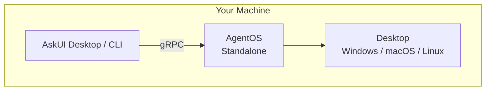
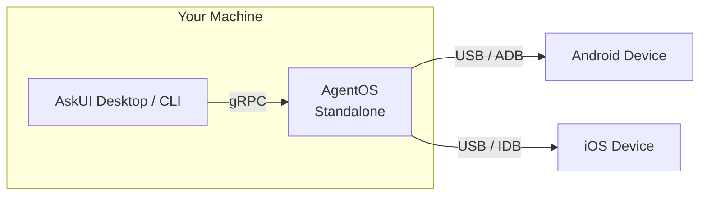
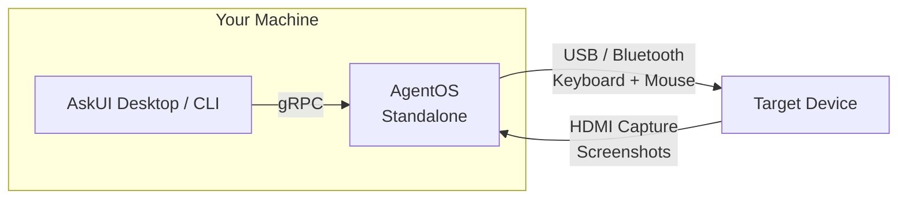

import { Aside, Steps } from '@astrojs/starlight/components';

You're building and testing agents on your own machine. In all local scenarios, you install AgentOS via `pip install askui-agent-os`, and AskUI Desktop and the CLI connect to the local AgentOS instance over gRPC.

## Desktop

Automate the desktop on your own Windows, macOS, or Linux machine. AgentOS runs in standalone mode alongside your agent code.

**When to use:** Day-to-day development, debugging, and interactive testing.

**Install:** `pip install askui-agent-os` → [Standalone](/agentos/installation/standalone/)



Your agent code and AgentOS run on the same machine. AskUI Desktop and the CLI send commands via gRPC, and AgentOS translates them into OS-level actions — screenshots, keyboard input, mouse control.

## Mobile Device

Automate an Android or iOS device connected to your machine via USB.

**When to use:** Mobile app testing, device interaction during development.

**Install:** `pip install askui-agent-os` → [Standalone](/agentos/installation/standalone/)



AgentOS acts as a bridge: it receives commands via gRPC and forwards them to the connected device using ADB (Android) or IDB (iOS). The device stays connected via USB.

<Aside type="note">You only need one of ADB or IDB depending on your target device — both are shown for completeness.</Aside>

### Android: Setting up ADB

ADB (Android Debug Bridge) must be available on your PATH. ADB works with both physical devices and emulators. See Google's guide on [running apps on the Android Emulator](https://developer.android.com/studio/run/emulator) to get started with emulators.

<Steps>

1. **Download SDK Platform Tools**

   Download from [developer.android.com](https://developer.android.com/tools/releases/platform-tools) and unzip to a folder (e.g. `C:\platform-tools` or `~/platform-tools`).

2. **Add to PATH**

   Add the unzipped folder to your **User** or **System PATH** environment variable.

3. **Verify**

   Open a new terminal and run:
   ```bash
   adb version
   ```
   You should see the ADB version output.

</Steps>

### iOS: Setting up IDB (macOS only, experimental)

iOS automation requires macOS with Xcode and the Facebook IDB companion. IDB currently only works with **iOS Simulators**, not physical devices. This feature is **experimental**. See Apple's guide on [running your app in Simulator](https://developer.apple.com/documentation/xcode/running-your-app-in-simulator-or-on-a-device) to get started.

<Steps>

1. **Install Xcode with iOS Simulators**

   Install [Xcode](https://developer.apple.com/xcode/) from the App Store and configure iOS Simulators. Verify they are visible:
   ```bash
   xcrun xctrace list devices
   ```

2. **Install IDB companion**

   ```bash
   brew tap facebook/fb
   brew install idb-companion
   ```

3. **Verify**

   Open a new terminal and run:
   ```bash
   idb_companion --list 1
   ```
   You should see your available simulators or devices listed.

</Steps>

## KVM (External Hardware)

Control a target device through physical hardware connections — keyboard/mouse via USB or Bluetooth, screen capture via HDMI.

**When to use:** The target device can't have software installed on it (locked-down environments, embedded systems, kiosks).

**Install:** `pip install askui-agent-os` → [Standalone](/agentos/installation/standalone/)



This is [Companion Mode](/agentos/understanding/control-modes/#companion-mode): AgentOS simulates keyboard and mouse input over USB or Bluetooth HID, and captures the target's screen via an HDMI-to-USB capture device. No software installation on the target is required.
