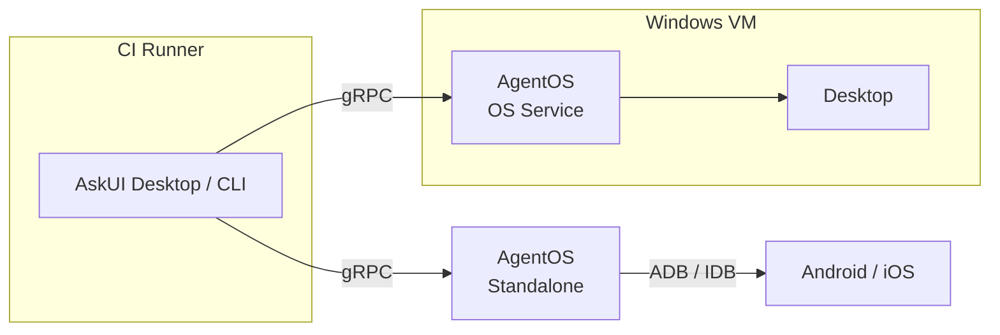
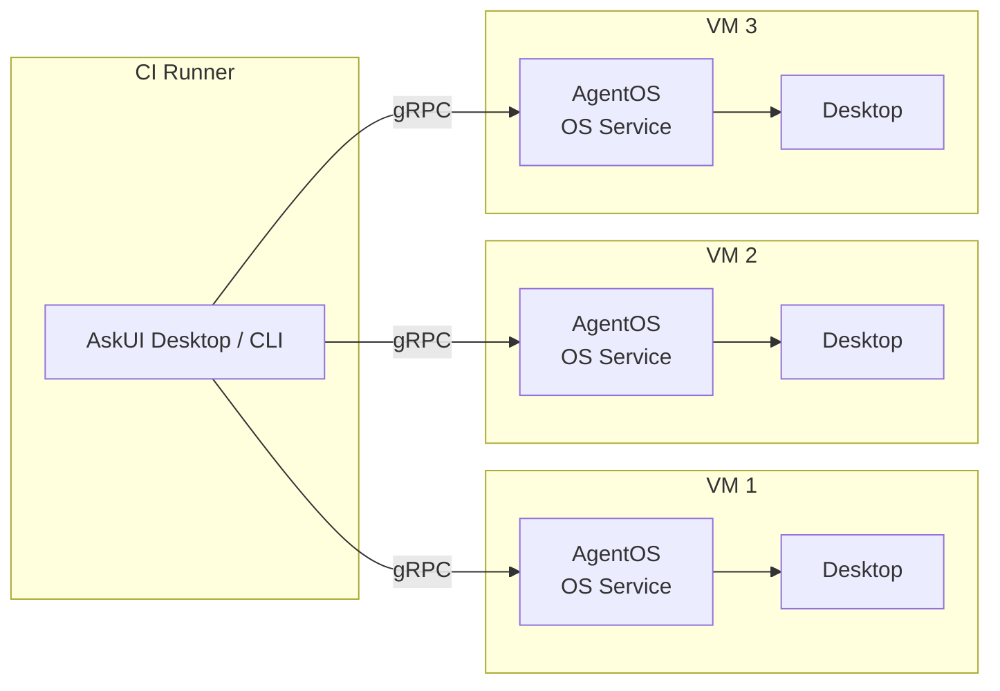
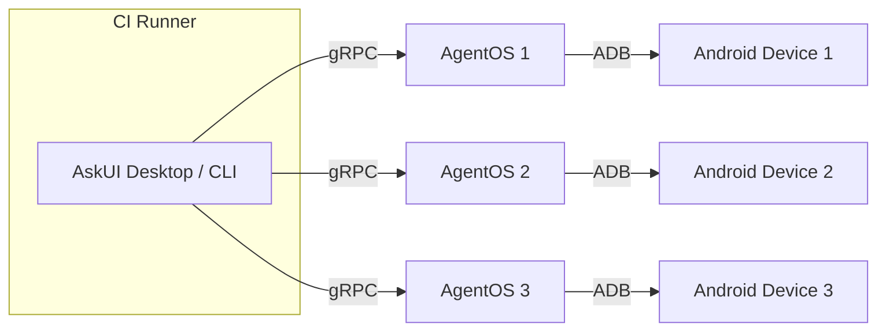
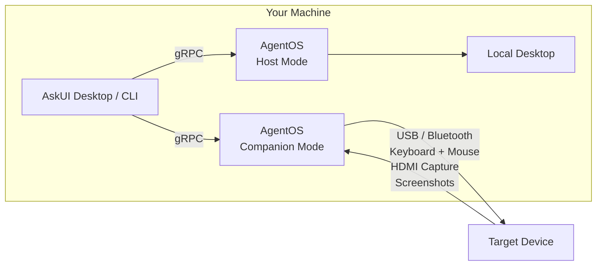

You need to automate across multiple targets — desktops, VMs, mobile devices, or hardware. In multi-device setups, AskUI Desktop and the CLI connect to **each AgentOS instance separately** via gRPC. There is no AgentOS-to-AgentOS communication.

## Windows + Mobile Device

Automate a Windows desktop and a mobile device from the same pipeline.

**When to use:** Cross-platform testing — e.g., a web app on Windows and its companion mobile app.

The client manages two independent gRPC connections: one to the AgentOS OS Service on the Windows VM, and one to a local AgentOS instance that controls the mobile device.

## Multiple Windows VMs

Scale desktop automation across several Windows VMs in parallel.

**When to use:** Running the same tests across different Windows configurations, or distributing a large test suite across machines for faster execution.

Each VM runs its own AgentOS OS Service. The client connects to all of them independently. Your pipeline code decides which commands go to which VM.

## Multiple Mobile Devices

Automate several Android (or iOS) devices connected to the same machine.

**When to use:** Testing across different device models, screen sizes, or OS versions in parallel.

Each device gets its own AgentOS instance. The client connects to each one over gRPC and routes commands to the right device.

## Desktop + KVM Device

Combine software-based desktop control with hardware-based control of an external device.

**When to use:** Testing interactions between a desktop application and a physical device that can't have software installed (e.g., an embedded system, kiosk, or industrial controller).

Two AgentOS instances run on the same machine, each in a different [control mode](/agentos/understanding/control-modes/): one controls the local desktop (Host Mode), the other controls the external device through hardware (Companion Mode). The client connects to both independently.
